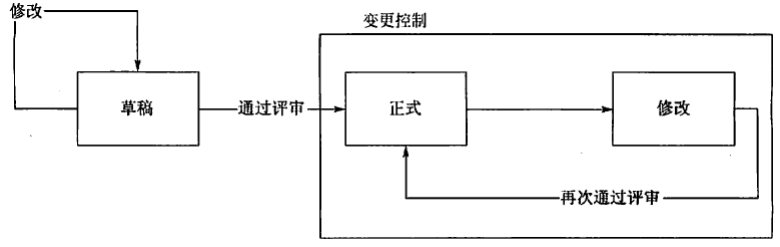
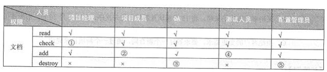

# 信息系统项目相关信息及其管理
## 信息系统项目相关信息（文档）
### 文档种类
+ 开发文档 开发文档是描述软件开发过程，包括软件需求、软件设计、软件测试、保证软件质量的一类文档，基本的开发文档是：
    + 可行性研究和项目任务书
    + 需求规格说明
    + 功能规格说明
    + 设计规格说明包括程序和数据规格说明
    + 开发计划
    + 软件集成和测试计划
    + 质量保证计划
    + 安全和测试信息
+ 产品文档
产品文档描述开发过程的产物，规定关于软件产品的使用、维护、增强、转换和传输的信息。基本的产品文档包括 ：
    + 培训手册
    + 参考手册和用户指南
    + 软件支持手册
    + 产品手册和信息广告
+ 管理文档 管理文档记录项目管理的信息，诸如：
    + 开发过程的每个阶段的进度和进度变更的记录
    + 软件变更情况的记录
    + 开发团队的职责定义
## 文档的分级
文档的质量可以按文档的形式和列出的要求划分为四级：  
+ 最底限度文档（1级文档）适合开发工作量低于一个人月的开发者自用程序。包含程序清单、开发记录、测试数据和程序简介。
+ 内部文档（2级文档）用于没有与其他用户共享资源的专用程序除1级文档提供的信息外，2级文档还包括程序清单内足够的注释以帮助用户安装和使用程序。
+ 工作文档（3级文档）适合于由同一单位内若干人联合开发的程序，或可被其他单位使用的程序。
+ 正式文档（4级文档）适合那些要正式发行供普遍使用的软件产品。关键性程序或具有重复管理应用性质（如工资计算）的程序需要4级文档。4级文档应遵守GB8567 的有关规定。

# 配置管理
配置管理是为了系统的控制配置变更，在系统的整个生命周期中维持配置的完整性和可跟踪性，而标识系统在不同时间点上配置的学科。  
## 配置管理能够解决以下问题：
+ 多重维护问题。 用户需要修改某文档时，必须从配置库中检出该文档，修改后再检入，每个用户需要该文档时都从配置库中检出最新的文档。
+ 同时修改问题。
+ 丢失版本或不知版本。这个问题的解决要明确规定保留哪个版本，销毁哪个版本；
## 配置管理包括6个主要活动过程：
+ 制定配置管理计划
+ 配置标识
+ 配置控制
+ 配置状态报告
+ 配置审计
+ 发布管理和交付
## 配置项
信息系统中的文档和软件在其开发、运行、维护的过程中会得到许多阶段性的成果，并且每个文档、软件在开发和运行过程中还需要用到多种工具软件或配置。这些信息项是配置管理的对象，称为配置项。  
典型配置项包括项目计划书、需求文档、设计文档、源代码、可执行代码、测试用例、运行软件所需的各种数据。
### 配置项可分为
+ 基线配置项：包括所有的设计文档和源程序。
+ 非基线配置项：包括项目的各类计划和报告等。所有配置项的操作权限由CMO(配置管理员)严格管理，基本原则：
+ 基线配置项向开发人员开放读取权限
+ 非基线配置项向PM、CCB及相关人员开放
### 配置项状态
配置项的状态可分为“草稿”、“正式”和“修改”三种
+ 配置项刚建立时，其状态为“草稿”。
+ 配置项通过评审后，其状态变为“正式”。
+ 此后若更改配置项，则其状态变为“修改”。
+ 当配置项修改完毕并重新通过评审时，其状态又变为“正式”
  
### 配置项版本号
配置项的版本号规则与配置项的状态相关  
+ 处于“草稿”状态的配置项的版本号格式为0.YZ，YZ的数字范围为01～99。随着草稿的修正，YZ的取值应递增。YZ的初值和增幅由用户自己把握。
+ 处于“正式”状态的配置项的版本号格式为X.Y，X为主版本号，取值范围为1～9。Y为次版本号，取值范围为0～9。
+ 处于“修改”状态的配置项的版本号格式为X.YZ。配置项正在修改时，一般只增大Z值，X.Y值保持不变。
### 版本控制(Version Control)
版本控制用于管理信息工程中生成的各种不同的配置，将规程和相关管理工具结合起来。  
通常有以下几种版本命名的方法  
+ 号码版本标志。以数字表示，如用1.0、2.0、1.2、2.1.1等表示版本号。
+ 符号版本标志。这种标志版本的命名方法是将重要的版本属性有选择地给出，如Windows 98，Windows 2000
### 配置基线
基线(Baseline)，是软件文档或源代码(或其它产出物)的一个稳定版本，它是进一步开发的基础。    
+ 基线是项目储存库中每个工件版本在特定时期的一个“快照”。它提供一个正式标准，随后的工作基于此标准，并且只有经过授权后才能变更这个标准。
+ 在建立基线之前，工作产品的所有者能快速、非正式地对工作产品做出变更。但基线建立之后，变更要通过评价和验证变更的正式程序来控制。

基线的种类  
+ 功能基线 功能基线是指在系统分析和定义阶段结束时，经过正式评审批准的系统设计规格说明中对被开发软件系统的规格说明；或是指经过项目委托单位和项目承办单位双方签字同意的协议或合同中所规定的对被开发软件系统的规格说明。
+ 分配基线 分配基线是指在软件需求分析阶段结束时，经正式评审和批准的软件需求规格说明。
+ 产品基线 产品基线是指在软件组装与系统测试阶段结束时，经正式评审和批准的有关所开发的软件产品的全部配置项的规格说明
### 配置库
配置库是一组受控制的、辅助软件开发使用和维护的软件及相关的文档。  
#### 配置库的作用  
+ 记录与配置相关的所有信息，其中存放受控的配置项是很重要的内容。
+ 利用库中的信息可评价变更的后果，这对变更控制有着重要的意义。
+ 从库中可提取各种配置管理过程的管理信息。
#### 配置库的分类
+ 开发库(Development Library)。存放开发过程中需要保留的各种信息，供开发人员个人专用。无须对其做任何限制。
+ 受控库(Controlled Library)。在软件开发的某个阶段工作结束时，将工作产品存入或将有关的信息存入。应该对库内信息的读/写和修改加以控制。
+ 产品库(Product Library)。在开发的软件产品完成系统测试之后，作为最终产品存入库内，等待交付用户或现场安装。库内的信息也应加以控制。
#### 配置库权限设置

  

###  变更控制委员会(Change Control Board, CCB)
也可称为配置控制委员会，是配置项变更的监管组织。其任务是对建议的配置项变更做出评价、审批，以及监督已批准变更的实施。    
CCB 的成员通常包括项目经理、用户代表、产品经理、开发工程师、测试工程师、质量控制人员、配置管理人员等。
## 配置控制
配置控制即配置项和基线的变更控制，流程如下:  
+ 变更申请 相关人员如项目经理填写变更申请表，说明要变更的内容、变更的原因、受变更影响的关联配置项、工作量和变更实施人等，并提交给CCB。
+ 变更评估 CCB负责组织对变更申请进行评估并确定以下内容
    + 变更的内容是否合理。
    + 变更的范围是否正确、考虑周全。
    + 受影响的配置项是否已被充分考虑，是否需要同时进行变更。
    + 工作量估计是否合理。
    + 如有变更实施方案，评估基线变更的实施方案是否合理。根据变更影响大小，可以由CCB组长确定由哪些人参与此评估，CCB决定是否接受变更，并将决定通知相关人员。
+ 变更实施 配置工程师在测试库或开发库中开辟工作空间，从受控库中取出相关的配置项放于工作空间，分配权限给变更实施人。变更实施人完成变更并提交后，项目经理指派其他的人员完成单元测试／代码走查。
+ 变更验证与确认 项目经理指定人员对变更后的配置项进行测试或验证，如走查、评审，填写相应报告。项目经理应将变更与验证的结果提交CCB组长审批，由其确认变更是否已经按要求完成。如果是基线变更，必要时CCB组长应召集CCB会议确认基线变更的结果。
+ 变更的发布 配置管理员将变更内容和结果通知相关人员，并做好记录
## 配置审计
### 实施配置审计的作用
配置审计的主要作用是作为变更控制的补充手段，来确保某一变更需求已被确实实现。
### 功能配置审计
功能配置审计是进行审计以验证以下几个方面。  
+ 配置项的开发已圆满完成。
+ 配置项已达到规定的性能和功能特性。
+ 配置项的运行和支持文档已完成并且是符合要求的。 
### 物理配置审计
物理配置审计是审计配置项的完整性
+ 要交付的配置项是否存在。
+ 配置项中是否包含了所有必需的项目。

