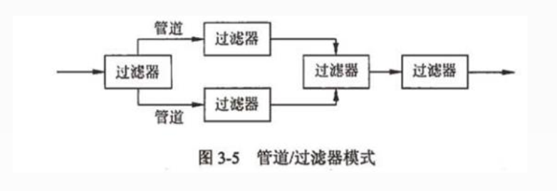
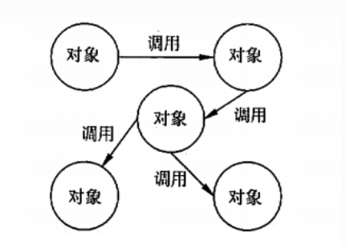
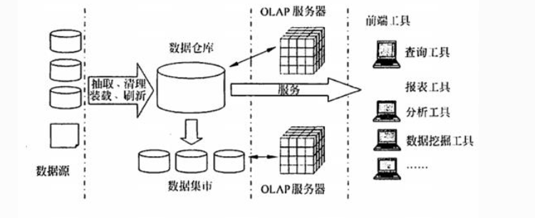
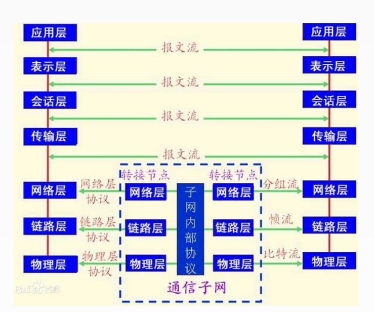
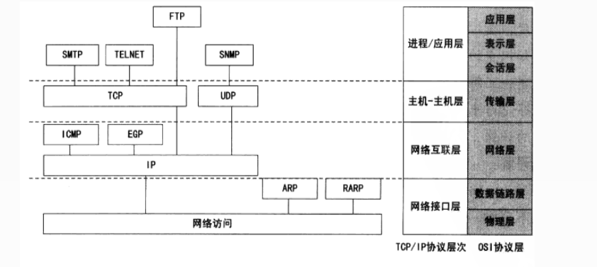
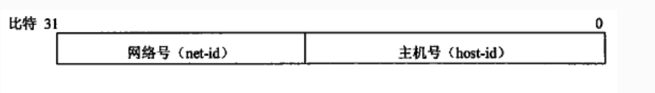
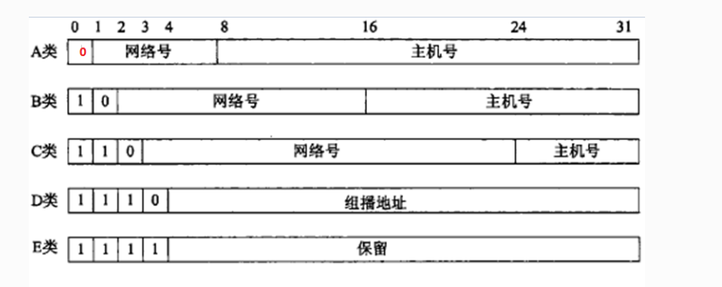

# 信息系统建设
## 信息系统的生命周期
信息系统建设的内容包括设备采购、系统集成、软件开发和运维服务。系统集成是指计算机软件、硬件、网络通信、信息安全等技术和产品集成为能够满足用户特定需求的信息系统  
信息系统的生命周期分为4个阶段 
+ 立项阶段
    + 概念阶段：根据用户单位业务发展和经营管理的需要，提出建设信息系统的初步构想；
    + 需求阶段：对企业信息系统的需求进行摄入调研和分析，形成《需求规格说明书》，经评审、批准后立项
+ 开发阶段
    + 总体规划阶段：以立项极端所做的需求分析为基础，明确信息系统在企业经营战略中的作用和地位，知道信息系统的开发，优化配置并利用各种资源，包括内部资源和外部资源，通过规划过程规范或完善用户单位的业务流程
    + 系统分析阶段：目标是为系统设计阶段提供系统的逻辑模型，内容包括组织结构及能力功能分析、业务流程分析、数据和数据流程分析及系统初步方案
    + 系统设计极端：根据系统分析的结果设计出信息系统的实施方案，主要内容包括系统架构设计、数据库设计、处理流程设计、功能模块设计、安全控制方案设计、系统组织和队伍设计及系统管理流程设计
    + 系统实施阶段：是将设计阶段的成果在计算机和网络上具体实现，即将设计文本变成能在计算机上运行的软件系统
    + 系统验收阶段：对系统性能的优劣及其他各项指标进行检查，判断是否满足系统需求的阶段
+ 运维阶段：信息系统通过验收，正式移交用户以后，就进入运维阶段，维护分为四种类型
    + 更正性维护
    + 适应性维护
    + 完善性维护
    + 预防性维护
+ 消亡阶段：系统不再适应当前环境，或是没有必要再进行维护，系统就进入消亡阶段
## 信息系统开发方法
在系统开发时，为了更好地控制时间、质量、成本等方面的要求及达到用户满意，除了技术、管理等因素外，系统开发方法也很重要。  
常用的开发方法有结构化方法、原型法、面向对象方法
## 结构化方法
按照信息系统舍命周期，应用结构化系统开发方法，吧整个系统的开发过程分为果敢阶段，然后一步一步地依次进行，前一阶段是后一阶段的工作依据；每个阶段又划分详细点的工作步骤，顺序作业。  

结构化方法的优点：理论基础严密，注重开发过程的整体性和全局性。  
结构化方法的缺点：开发周期长；文档、设计说明繁琐，工作效率低；要求在开发之初全面认识系统的信息需求，充分预测各种可能发生的变化
## 原型法
在很难全面准确地提出用户需求的情况下，不要求一定要对系统做全面、详细的调查、分析，而是以开发人员对用户需求的初步理解，先快速开发一个原型系统，然后通过反复修改来实现用户的最终系统需求。原型法可以分为两类：
+ 抛弃型原型：原型在系统真正实现以后就放弃不用了
+ 进化型原型：从目标系统的一个或几个基本需求出发，通过修改和追加功能的过程逐渐丰富，演化成最终系统
## 面向对象方法（Object Oriented,OO）
应用系统日益复杂和面向对象程序设计语言的日益成熟，面向对象的系统开发以其直观，方便的有点获得广泛应用。  
面向对象方法主要有分析、设计和实现三个阶段。在整个过程中都使用同一套工具完成。

# 信息系统设计

# 软件工程
软件成本日益增长、开发进度难以控制、软件质量无法保证、软件维护困难。主要是开发软件规模越来越大、复杂度越来越高，于此同时，用户需求不十分明确且缺乏软件开发方法和工具方面的支持。所以需要将系统化的、严格约束的、可量化的方法应用于软件开发、运行和维护，即是软件工程
## 软件需求分析与定义
软件需求是一个为解决特定问题而必须由被开发或被修改的软件展示的特性  
软件需求敖阔三个不同的层次
+ 业务需求：反映了组织机构或客户对系统、产品高层次的目标要求。
+ 用户需求：描述了用户使用产品必须要完成的任务
+ 功能需求：定义了开发人员必须实现的软件功能，使得用户能完成 他们的任务，从容满足了业务需求
## 软件设计、测试与维护
### 软件设计
软件设计是描述软件架构和这些组件之间的接口，然后进一步详细的描述组件，以便能构造这些组件。
### 软件测试
测试是为评价和改进产品质量、识别产品的缺陷和问题而进行的活动。
现在的软件测试被认为是一种应该包括在整个开发和维护过程中的活动，它本身是实际产品构造的一个重要部分。  
#### 动态测试指通过运行程序发现错误，分为：
+ 黑盒测试法 黑盒测试又称为功能测试。 把被测试对象看成一个黑盒子，测试人员完全不考虑程序的内部结构和处理过程，只在软件的接口处进行测试，依据需求规格说明书，检查程序是否满足功能要求。
+ 白盒测试法 称结构测试、透明盒测试、逻辑驱动测试或基于代码的测试。把测试对象看做一个打开的盒子，测试人员必须了解程序的内部结构和处理过程，以检查处理过程的细节为基础，对程序中尽可能多的逻辑路径进行测试，检验内部控制结构和数据结构是否有错，实际的运行状态与预期的状态是否一致。
+ 灰盒测试法 灰盒测试是一种介于白盒测试与黑盒测试之间的测试，它关注输出对于输入的正确性，同时也关注内部表现，但这种关注不像白盒测试那样详细且完整，而只是通过一些表征性的现象、事件及标志来判断程序内部的运行状态
#### 按测试阶段：单元测试、 集成测试、 系统测试和验收测试。
+ 单元测试的粒度最小，一般由开发小组采用白盒方式来测试，主要测试单元是否符合“设计”要求。
+ 集成测试界于单元测试和系统测试之间，起到“桥梁作用”，一般由开发小组采用白盒加黑盒的方式来测试，既验证“设计”，又验证“需求
+ 系统测试的粒度最大，一般由独立测试小组采用黑盒方式来测试，主要测试系统是否符合“需求规格说明书”。
+ 验收测试与系统测试相似，主要区别是测试人员不同，验收测试由用户执行。验收测试分为
    +  α测试：是由用户在开发环境下进行的测试，也可以是公司内部的用户在模拟实际操作环境下进行的测试。 α测试的目的是评价软件产品的FLURPS(即功能、局域化、可使用性、可靠性、性能和支持)。
    + β测试：是软件的真实用户在实际使用环境下进行的测试。开发者通常不在测试现场，Beta测试不能由程序员或测试员完成。
### 软件维护
软件投入运行，还可能发现缺陷，运行环境可能会变化，用户会提出新的需求。
#### 软件维护类型
+ 更正性维护。指改正在系统开发阶段已发生而系统测试阶段尚未发现的错误。
+ 适应性维护。指使用软件适应信息技术变化和管理需求变化而进行的修改。计算机领域发展变化十分迅速，经常会出现新的系统或新的版本，外部设备及其他系统软件经常在改变，常需对软件加以改造，使之适应于新的环境。为使软件产品在新的环境下仍能使用而进行的维护，称为适应性维护。
+ 完善性维护。在系统的使用过程中，用户往往要求扩充原有系统的功能，增加一些在软件需求规范书中没有规定的功能与性能特征，以及对处理效率和编写程序的改进
+ 预防性维护。选择那些还有较长使用寿命，目前尚能正常运行，但可能将要发生变化或调整的系统进行维护，目的是通过预防性维护为未来的修改与调整奠定更好的基础。
### 软件复用
软件复用是指利用已有软件的各种有关知识构造新的软件，以缩减软件开发和维护的费用。  
软件复用是提高软件生产力和质量的一种重要技术。  
软件制品的复用，按抽象程度的高低，可以划分为：代码的复用、设计的复用、分析的复用、测试信息的复用等。
## 软件质量保证及质量评价
软件质量的定义是：软件特性的总和，软件满足规定或潜在用户需求的能力。也就是说，质量就是遵从用户需求，达到用户满意    
软件“产品质量”国际标准ISO9126定义的软件质量包括“内部质量”、“外部质量”和“使用质量”三部分。也就是说，“软件满足规定或潜在用户需求的能力”要从软件在内部、外部和使用中的表现来衡量。
### 软件质量管理过程包括
+ 软件质量保证 软件质量保证过程通过计划制订、实施和完成一组活动提供保证，这些活动保证项目生命周期中的软件产品和过程符合其规定的需求。
+ 验证与确认 验证与确认过程确定某一开发和维护活动的产品是否符合活动的需求，最终的软件产品是否达到其意图并满足用户需求。
+ 评审与审计 评审与审计过程包括：管理评审、技术评审、检查、走查、审计等
    + 管理评审的目的是监控进展，决定计划和进度的状态，确认需求及其系统分配，或评价用于达到目标适应性的管理方法的有效性。
    + 技术评审的目的是评价软件产品。以确定其对使用意图的适合性，目标是识别规范说明和标准的差异，并向管理提供证据，以表明产品是否满足规范说明并遵从标准，而且可以控制变更。
    + 检查的目的是检测和识别软件产品异常。一次检查通常针对产品的一个相对小的部分。发现的任何异常都要记录到文档中，并提交。
    + 走查的目的是评价软件产品，走查类似于检查，但通常不那么正式。走查通常主要由同事评审其工作，以作为一种保障技术。
    + 软件审计的目的是提供软件产品和过程对于可应用的规则、标准、指南、计划和流程的遵从性的独立评价。审计是正式组织的活动，识别违例情况，并产生一个报告，采取更正性行动。
## 软件配置管理
软件配置管理是有益于项目管理、开发和维护活动。软件配置管理与软件质量保证活动密切相关，软件配置管理活动可以帮助达成软件质量保证目标。
### 软件过程管理
软件过程管理涉及技术过程和管理过程，包括以下几个方面：
+ 项目启动与范围定义
+ 项目规划
+ 项目实施
+ 项目监控与评价
+ 项目收尾与关闭
## 软件开发工具
+ 软件需求工具
+ 软件设计工具
+ 软件构造工具
+ 软件测试工具
+ 软件维护工具
+ 软件配置管理工具
+ 软件工程管理工具
+ 软件工程过程工具
+ 软件质量工具

# 面向对象系统分析与设计
## 面向对象系统分析与设计 
面向对象的基本概念有对象、类、抽象、封装、继承、多态、接口、消息、组件、模式和复用等。
### 对象（Object）
是系统中用来描述客观事物的一个实体，它是构成系统的基本单位，由一组属性和施加于这组属性的一组操作构成。
+ 对象中的属性（Attribute）用来描述对象静态特征的一个数据项。
+ 对象中的操作（Operation）用来描述对象动态特征（行为）的一个动作序列
### 类（class）
+ 相同属性和操作的一组对象属于同一个类
+ 它为属于该类的全部对象提供了统一的抽象描述
+ 由一个类名、一组属性和一组操作构成
+ 同一个类的对象之间，属性值可不同，操作完全相同
+ 类的作用 用于创建对象，对象是类的实例。
### 抽象
从事物中舍弃个别的、非本质的特征，保留共同的、本质特征的做法。对象是现实世界中某个实体的抽象，类是一组对象的抽象。
### 封装（encapsulation）
用对象把属性和操作包装起来，形成一个独立的实体单位，并尽量对外隐蔽内部细节，外部只能看到对象操作的反应，而不知道对象是如何做出这一反应的
### 继承（inheritance）
特殊类自动拥有其一般类的全部属性和操作，称为特殊类对一般类的继承，也称一般类对特殊类的泛化。
### 多态性（polymorphism）
特殊类可定义同名的属性或操作，来代替继承来的属性或操作；一般类中的属性或操作，在不同特殊类中可有不同的实现。
### 消息（message）
+ 向一个对象发送的操作请求，称为消息；
+ 对象之间通过消息进行通信，实现对象之间的动态联系。
+ 在c++中是函数调用，在Java中是方法激活。
## RUP(统一软件过程)
描述了如何有效地利用商业的可靠的方法开发和部署软件，是一种重量级过程，因此特别适用于大型软件团队开发大型项目。RUP将周期划分为4个连续的阶段，即初始阶段、细化阶段、构造阶段和交付阶段。
### RUP的三大特点：
+ 用例驱动的
+ 以体系结构为中心的
+ 迭代和增量的

# 软件架构
将软件系统划分成多个模块，明确各模块之间的相互作用，组合起来实现系统的全部特性，就是系统的架构。
## 典型架构
软件架构设计的一个核心问题是能否使用重复的架构模式，即能否达到架构级的软件复用。
## 常见的架构模式：
+ 管道/过滤器模式 在管道/过滤器架构模式中，每个构件都有一组输入、输出，构件读取输入的数据流，经过内部处理后，产生输出数据流，该过程主要完成输入流的变换及增量计算。

+ 面向对象模式 面向对象模式建立在数据抽象和面向对象的基础上，将数据的表示方法及其相应操作封装在一个抽象数据类型或对象中。
  
  面向对象模式的优点如下。
    + 高度模块化。
    + 封装功能实现了数据隐藏。
    + 继承性提供了一种实现代码共享的手段。
    + 提供了系统的灵活性，便于维护及扩充。
+ 事件驱动模式
+ 分层模式
+ 客户机／服务器模式 客户机/服务器(C/S)模式是基于资源不对等，为实现共享而提出的。 C/S模式将应用一分为二，服务器（后台）负责数据管理，客户机（前台）完成与用户的交互任务。
## 软件中间件
中间件是位于硬件、操作系统等平台和应用之间的通用服务，这些服务具有标准的程序接口和协议。借助中间件，解决了分布系统的异构问题。  
从不同的角度对中间件的分类也会有所不同。通常将中间件分为：
+ 数据库访问中间件(ODBC、 JDBC)
+ 远程过程调用中间件(RPC)
+ 面向消息中间件(MOM)
+ 分布式对象中间件(CORBA、 DCOM、 RMI/EJB)
+ 事务中间件(TPM)

# 典型应用集成技术
## 数据库与数据仓库技术
传统的数据库技术以单一的数据资源--数据库为中心，进行事务处理、批处理、决策分析等各种数据处理工作，主要有操作型处理和分析型处理两类
+ 操作型处理也称事务处理，是指对联机数据库的日常操作，通常是对数据库中记录的查询和修改，主要为企业的特定应用服\务，强调处理的响应时间、 数据的安全性和完整性等；
+ 分析型处理则用于管理人员的决策分析，经常要访问大量的历史数据。
数据仓库(Data Warehouse)是一个面向主题的、 集成的、相对稳的、反映历史变化的数据集合，用于支持管理决策。一个典型的企业数据仓库系统通常包含数据源、数据存储与管理、 OLAP服务器以及前端工具与应用四个部分。 
  
### 数据仓库是面向主题的
操作型数据库的数据组织面向事务处理任务，而数据仓库中的数据是按照一定的主题域进行组织。主题是指用户使用数据仓库进行决策时所关心的重点方面，一个主题通常与多个操作型信息系统相关。
### 数据仓库是集成的
数据仓库的数据有来自于分散的操作型数据，将所需数据从原来的数据中抽取出来，进行加工与集成，统一与综合之后才能进入数据仓库；  
### 数据仓库是相对稳定的
数据仓库主要是为决策分析提供数据，所涉及的操作主要是数据的查询；
### 数据仓库是随时间而变化的
传统的关系数据库系统比较适合处理格式化的数据，能够较好的满足商业商务处理的需求。稳定的数据以只读格式保存，且不随时间改变。  
## Web Services技术
Web服务(Web Services)定义了一种松散的、粗粒度的分布计算模式，使用标准的HTTP (S)协议传送XML表示及封装的内容  
Web服务的典型技术包括：
+ 简单对象访问协议（SOAP）
+ Web服务描述语言（WSDL）
+ 统一描述、发现及集成（UDDI）
+ 用于数据交换的XML
## JavaEE架构
JavaEE是一个开发分布式企业级应用的规范和标准。 JavaEE技术体系结构可分为：表示层技术、中间层技术、数据层技术  
+ 表示层：由用户界面和用户生成界面的代码组成。
+ 中间层：包含系统的业务和功能代码。
+ 数据层：负责完成存取数据库的数据和对数据进行封装。
## .NET架构
.NET架构是一个多语言组件开发和执行环境，它提供了一个跨语言的统一编程环境。 .NET框架的目的是便于开发人员更容易地建立Web应用程序和Web服务，使得Internet上的各应用程序之间，可以使用Web服务进行沟通。从层次结构来看，.NET框架包括三个主要组成部分：  
+ 公共语言运行时（CLR）
+ 服务框架（Services Framework）
+ 上层的两类应用模板--传统的Windows应用程序模板和基于ASP
+ NET的面向Web的网络应用程序模板
## 常用组件标准
常用组件标准包括：
+ 微软的COM/DCOM/COM+
+ OMG的CORBA
+ Java的EMI/EJB

# 计算机网络
## 网络技术标准与协议
### OSI七层模型
1. 物理层 物理层协议要解决的是主机、工作站等数据终端设备与通信线路上通信设备之间的接口问题。
2. 数据链路层 建立、维持和释放网络实体之间的数据链路，这种数据链路对网络层表现为一条无差错的信道。其服务访问点为MAC地址。它通常把流量控制和差错控制合并在一起。数据链路层可以分为MAC（媒介访问控制）和LLC（逻辑链路控制）
3. 网络层 属于通信子网，通过网络连接交换传输层实体发出的数据。网络解决的问题是路由选择、网络拥塞、异构网络互联等问题，其服务访问点为逻辑地址（也称为网络地址）。代表性协议有IP，IPX ,ICMP , IGMP协议等
4. 传输层 实现发送端和接收端的端到端的数据分组传送，负责保证实现数据包无差错、按顺序、无丢失和无冗余的传输。服务访问点为端口。代表性协议有TCP，UDP，SPX协议等。
5. 会话层
6. 表示层
7. 应用层
  
OSI是一种分层的体系结构，每一层中由一些实体（包括软件元素和硬件元素）组成，它的基本想法是每一层都在它的下层提供的服务的基础上提供更高级的增值服务，而每一层是通过服务访问点(SAP)来向上一层提供服务的  
在OSI分层结构中，其目标是保持层次之间的独立性，也就是第N层实体只能够使用(N-1)层实体通过SAP提供的服务，并且只能够向(N+1)层提供服务，实体间不能够跨层使用，也不能够同层调用。  
### TCP/IP参考模型
该网络协议分为四层：网络接口层、网络互联层、传输层和应用层

## Internet技术及应用
Internet中任何两台主机的IP地址不相同，但是允许一台主机拥有多个IP地址。  
IP地址的长度为32位(4个字节)，分为网络号和主机号两部分。网络号标识一个网络，由互联网络信息中心( InterNIC)统一分配。主机号用来标识网络中的一个主机，由网络中的管理员来具体分配。  
### 分类IP地址结构及类别
IP地址是由32位二进制数，即4个字节组成的，它由网络号和主机号两个字段组成
  
网络号的位数决定了可以分配的网络数（2的n次方）
主机号的位数决定了网络中最大主机个数（2的m次方-2）  
为了便于对IP地址进行管理，把IP地址分成为5类，即A类到E类，目前大量使用的是A，B，C三类。  
  

# 新兴信息技术