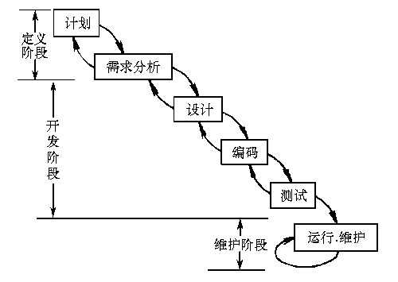

# 信息系统建设
## 信息系统的生命周期
信息系统建设的内容包括设备采购、系统集成、软件开发和运维服务。系统集成是指计算机软件、硬件、网络通信、信息安全等技术和产品集成为能够满足用户特定需求的信息系统  
信息系统的生命周期分为4个阶段 
+ 立项阶段
    + 概念阶段：根据用户单位业务发展和经营管理的需要，提出建设信息系统的初步构想；
    + 需求阶段：对企业信息系统的需求进行摄入调研和分析，形成《需求规格说明书》，经评审、批准后立项
+ 开发阶段
    + 总体规划阶段：以立项极端所做的需求分析为基础，明确信息系统在企业经营战略中的作用和地位，知道信息系统的开发，优化配置并利用各种资源，包括内部资源和外部资源，通过规划过程规范或完善用户单位的业务流程
    + 系统分析阶段：目标是为系统设计阶段提供系统的逻辑模型，内容包括组织结构及能力功能分析、业务流程分析、数据和数据流程分析及系统初步方案
    + 系统设计极端：根据系统分析的结果设计出信息系统的实施方案，主要内容包括系统架构设计、数据库设计、处理流程设计、功能模块设计、安全控制方案设计、系统组织和队伍设计及系统管理流程设计
    + 系统实施阶段：是将设计阶段的成果在计算机和网络上具体实现，即将设计文本变成能在计算机上运行的软件系统
    + 系统验收阶段：对系统性能的优劣及其他各项指标进行检查，判断是否满足系统需求的阶段
+ 运维阶段：信息系统通过验收，正式移交用户以后，就进入运维阶段，维护分为四种类型
    + 更正性维护
    + 适应性维护
    + 完善性维护
    + 预防性维护
+ 消亡阶段：系统不再适应当前环境，或是没有必要再进行维护，系统就进入消亡阶段
## 信息系统开发方法
在系统开发时，为了更好地控制时间、质量、成本等方面的要求及达到用户满意，除了技术、管理等因素外，系统开发方法也很重要。  
常用的开发方法有结构化方法、原型法、面向对象方法
## 结构化方法
按照信息系统舍命周期，应用结构化系统开发方法，吧整个系统的开发过程分为果敢阶段，然后一步一步地依次进行，前一阶段是后一阶段的工作依据；每个阶段又划分详细点的工作步骤，顺序作业。  

结构化方法的优点：理论基础严密，注重开发过程的整体性和全局性。  
结构化方法的缺点：开发周期长；文档、设计说明繁琐，工作效率低；要求在开发之初全面认识系统的信息需求，充分预测各种可能发生的变化
## 原型法
在很难全面准确地提出用户需求的情况下，不要求一定要对系统做全面、详细的调查、分析，而是以开发人员对用户需求的初步理解，先快速开发一个原型系统，然后通过反复修改来实现用户的最终系统需求。原型法可以分为两类：
+ 抛弃型原型：原型在系统真正实现以后就放弃不用了
+ 进化型原型：从目标系统的一个或几个基本需求出发，通过修改和追加功能的过程逐渐丰富，演化成最终系统

# 信息系统设计
# 软件工程
# 面向对象系统分析与设计
# 软件架构
# 典型应用集成技术
# 计算机网络
# 新兴信息技术