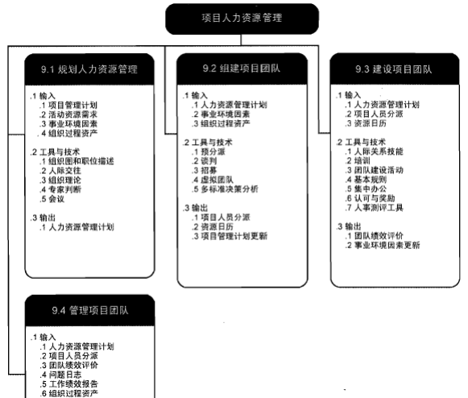
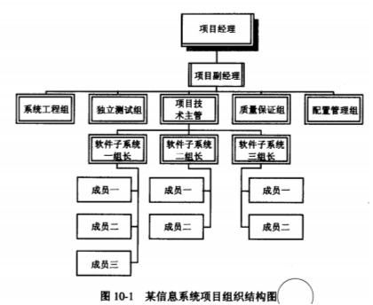
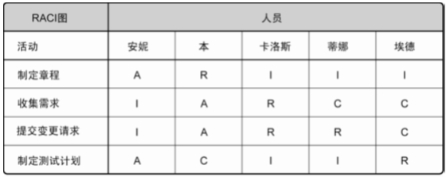
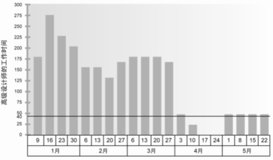

# 项目人力资源管理的定义
## 人力资源管理概念
项目人力资源管理就是要求充分发挥参与项目人员的作用。包括项目的所有利害关系者，如项目团队成员、用户、高层、投资人、合伙人、供应商/分包商等  
## 项目人力资源管理的过程
+ 编制项目人力资源计划
+ 组建项目团队
+ 建设项目团队
+ 管理项目团队

# 编制项目人力资源计划
人力资源计划涉及决定、记录和分配项目角色、职责及报告关系的过程  
这个过程生成项目的组织结构图、职责分配矩阵（RAM) 以及项目成员管理计划。  
## 组织结构图和职位描述
可采用多种格式来记录团队成员的角色与职责
+ 层次结构图
+ 责任分配矩阵
+ 文本格式
### 层次结构图
传统的组织结构图(OBS)，自上而下地描述团队中的角色及其相互关系。  
  
### 责任分配矩阵(RAM)
责任分配矩阵为项目工作（用WBS表示）和负责完成工作的人（用OBS表示）建立一个映射关系。  R负责，A参与，C征求意见，I通知。
  
### 文本格式
如果需要详细描述团队成员的职责，可以采用文本格式。文本格式通常以概述的形式，提供诸如职责、职权、能力和资格等方面的信息。这种文件有多种名称，如职位描述、角色—职责—职权表  
## 项目人力资源计划
人力资源管理计划为项目应该使用什么样的人员、如何配备、如何管理、如何控制，最终如何遣散提供了指南。  
人力资源计划应该包括:
+ 角色和职责分配
+ 项目的组织结构图
+ 人员配备管理计划  
### 人员配备管理计划
+ 人员招募
+ 资源日历
+ 人员遣散计划
+ 培训需求
+ 表彰和奖励
+ 遵守的规定
+ 安全性 
+ 资源日历 表明每种具体资源的可用工作日和工作班次的日历。项目管理团队可用资源直方图向所有干系人直观地展示人力资源分配情况。资源直方图显示在整个项目期间每周（或每月）需要某人、某部门或整个项目团队的工作小时数。
  

# 项目团队组织建设
## 组织项目团队
在明确项目人力资源的需求后，应授予项目经理以项目团队的组建权。  
项目经理应从各种来源物色团队成员，同有关负责人谈判，将满足要求的人编入项目团队，将计划编制阶段确定的角色连同责任分配给各个成员，明确他们之间的配合、汇报和从属关系，这就是组建项目团队的工作内容  
### 项目团队组建以成员管理计划为依据
项目团队成员可从组织内部和外部招收。人员招收可以通过如下方法获得:  
+ 事先分派
+ 谈判
+ 外部采购（招聘）
+ 虚拟团队
### 项目团队组建是一个动态的过程
项目经理必须能够监控到这种变化，在人员技能与项目需求不一致的情况下，及时与组织高层、人力资源经理及其他项目人员进行沟通，来保证项目对人员的动态需求。  
现今寻找技术专家越来越难的情况下，除了人员的招募，团队成员的保留也是项目团队组建中一个极其重要的问题。
## 现代激励理论体系
团队建设作为项目管理中唯一的一个管人的过程，其理论基础和实践经验大多是从人力资源管理理论、组织行为学借鉴的，下面分别从激励理论、X理论和Y理论、领导与管理、影响与能力等四个方面介绍  
### 激励理论
所谓激励，就是如何发挥员工的工作积极性的方法。典型的激励理论有：  
+ 马斯洛需要层次理论
+ 赫茨伯格的双因素理论
+ 期望理论
#### 马斯洛需要层次理论
+ 生理需要
+ 安全需要--包括对人身安全、生活稳定、不致失业以及免遭痛苦、威胁或疾病等的需要。
+ 社会交往的需要--包括对友谊、爱情以及隶属关系的需要。
+ 自尊的需要--指自尊心和荣誉感。
+ 自我实现的需要--指想获得更大的空间以实现自我发展的需要。
#### 赫茨伯格的双因素理论
双因素理论认为有两种完全不同的因素影响着人们的工作行为。  
第一类是保健因素( hygiene factor)，这些因素是与工作环境或条件有关的，能防止人们产生不满意感的一类因素，包括工作环境、工资薪水、公司政策、个人生活、管理监督、人际关系等。当保健因素不健全时，人们就会产生不满意感。但即使保健因素很好时，也无法增加人们对工作的满意感，所以这些因素是无法起到激励作用的。  
第二类是激励因素( motivator)，这些因素是与员工的工作本身或工作内容有关的、能促使人产生工作满意感的一类因素，是高层次的需要，包括成就、承认、工作本身、责任、发展机会等。当激励因素缺乏时，人们就会缺乏进取心，对工作无所谓，但一旦具备了激励因素，员工则会感觉到强大的激励力量而产生对工作的满意感，所以只有这类因素才能真正激励员工。  
#### 期望理论
期望理论关注的不是人们的需要的类型，而是人们用来获取报酬的思维方式，认为当人们预期某一行为能给个人带来预定结果，且这种结果对个体具有吸引力时，人们就会采取这一特定行动  
+ 目标效价，指实现该目标对个人有多大价值的主观判断。如果实现该目标对个人来说很有价值，个人的积极性就高；反之，积极性则低。  
+ 期望值，指个人对实现该目标可能性大小的主观估计。只有个人认为实现该目标的可能性很大，才会去努力争取实现，从而在较高程度上发挥目标的激励作用；反之，目标激励作用则小。
### X理论和Y理论
X理论体现了独裁型管理者对人性的基本判断，这种假设认为：  
+ 一般人天性好逸恶劳，只要有可能就会逃避工作。
+ 人生来就以自我为中心，漠视组织的要求。
+ 人缺乏进取心，甘愿听从指挥，安于现状，没有创造性。
+ 人们通常容易受骗，易受人煽动。
+ 人们天生反对改革。
崇尚X理论的领导者认为，必须对员工采取强制、惩罚和解雇等手段，对员工应当严格监督、控制和管理。  
Y理论认为：  
+ 人天生并不是好逸恶劳，他们热爱工作，从工作得到满足感和成就感。
+ 员工能够自己确定目标，自我指挥和自我控制。
+ 在适当的条件下，人们愿意主动承担责任。
+ 大多数人具有一定的想像力和创造力。
信奉Y理论的管理者对员工采取民主型和放任自由型的领导方式，在领导行为上遵循以人为中心的、宽容的及放权的领导原则。  
## 项目经理具有的五种权力
+ 合法的权力。是指在高级管理层对项目经理的正式授权的基础上，项目经理让员工进行工作的权力。
+ 强制力。是指用惩罚、威胁或者其他的消极手段强迫员工做他们不想做的事。
+ 专家权力。用个人知识和技能让员工改变他们的行为。如果项目经理让员工感到他在某些领域有专长，那么他们就会遵照项目经理的意见行事。
+ 奖励权力。就是使用一些激励措施来引导员工去工作。奖励包括薪金、职位、认可度、特殊的任务。
+ 感召权力(潜示权力)。权力是建立在个人感召权力的基础上
## 项目团队建设
项目团队成立后一般不能马上形成有效的战斗力，中间要有一个熟悉、适应和磨合的过程。项目团队建设就是培养、改进和提高项目团队成员个人，以及项目团队整体的工作能力，使项目管理团队成为一个特别有能力的整体  
+ 人际关系技能 人际关系技能有时被称为“软技能”，比如：沟通技巧、冲突解决方法、谈判技巧、团队建设技能。
+ 培训 为了促进个人和项目团队的健康发展，项目经理应该推荐项目成员去参加培训课程。
+ 团队建设活动 团队建设常用的方法包括挑战体能训练、心理偏好指标等工具
+ 基本规则 基本规则对项目团队成员的行为做出明确规定。比如：行为规范，沟通方式，会议礼仪。规则一旦制定，所有成员都要严格执行。
+ 同场地办公 集中办公是指将所有或者几乎所有重要的项目团队成员安排在同一个工作地点，以增进他们作为一个团队工作的能力。集中可以是暂时性的，如仅在项目的关键阶段，也可贯穿项目的始终。
+ 认可与奖励 将项目工作纳入到其绩效考核中，让他意识到项目工作并不是可有可无的，项目工作完成的好坏是直接与其个人收益挂钩  
+ 人事测评工具 人事评测工具能让项目经理和项目团队洞察成员的优势和劣势。这些工具可帮助项目经理评估团队成员的偏好和愿望，团队成员如何处理和整理信息，团队成员如何制定决策，以及团队成员喜欢如何与人打交道。有各种可用的工具，如态度调查、细节评估、结构化面谈、能力测试及焦点小组讨论。这些工具有利于增进团队成员间的理解、信任、忠诚和沟通，在整个项目期间不断提高团队成效。  
## 团队建设的五个发展阶段：
+ 形成阶段
+ 震荡阶段
+ 规范阶段
+ 发挥阶段
+ 结束阶段
# 项目团队管理
管理项目团队是跟踪团队成员工作表现，提供反馈，解决问题并管理团队变更，以优化项目绩效的过程。  
本过程的主要作用是，影响团队行为，管理冲突，解决问题，并评估团队成员的绩效。  
## 项目团队管理的方法
可以通过如下的工具与技术，实现对项目团队的管理。  
+ 观察和交谈 观察和交谈用于随时了解团队成员的工作情况和思想状态。
+ 项目绩效评估 在项目实施期间进行绩效评估的目标是澄清角色、责任，从团队成员处得到建设性的反馈，发现一些未知的和未解决的问题。
+ 问题清单 把管理项目团队的过程中出现的问题，记录在问题清单里有助于知道谁在预定日期前负责解决这个问题。同样，问题的解决有助于项目团队消除障碍。
+ 人际关系技能
## 冲突管理
### 认识冲突
冲突，就是计划与现实之间的矛盾，或人与人之间不同期望之间的矛盾，或人与人之间利益的矛盾。  
在管理项目过程中，最主要的冲突有进度、项目优先级、资源、技术、管理过程、成本和个人冲突7种。  
成功的冲突管理可以大大地提高生产力并促进积极的工作关系。如果冲突得以适当的管理，意见的分歧是有益的，可以增加创造力和做出更好的决策。  
当分歧变成负面因素时，项目团队成员应负责解决他们间的冲突。如果冲突升级，项目经理应帮助团队找出一个满意的解决方案。  
### 冲突的根源
+ 项目的高压环境 项目有明确的开始和结束时间、有限的预算都会造成项目的紧张和高压环境
+ 责任模糊 责任不清或权力责任失衡都会产生冲突。
+ 存在多个上级
+ 新科技的使用。IT技术更新快，造成大家对各种技术的不同态度和观点，引起冲突。  
### 处理冲突方法
+ 问题解决。这是冲突管理中最理想的一种方法。
+ 合作。集合多方的观点和意见，得出一个多数人接受和承诺的冲突解决方案。
+ 强制。强制就是以牺牲其他各方的观点为代价，强制采纳一方的观点。
+ 妥协。妥协就是冲突的各方协商并且寻找一种能够使冲突各方都有一定程度满意、是一种都做一些让步的冲突解决方法。
+ 求同存异
+ 撤退
## 知识型员工的特点
+ 具有很强的独立性和自主性，注重自我引导和自我管理
+ 忠诚度低，流动性强
+ 工作过程难以监控
+ 具有实现自我价值的强烈渴望
+ 个性突出  
## 知识型员工的管理方法
+ “管人”要向“管事”转变，侧重监管工作进度、质量和结果。
+ 激活个体的主观能动性，建立公平、公正和公开的内部竞争环境，
+ 要完善薪酬激励机制，全面推行绩效考核管理，激发知识员工的工作热情和创造力；
+ 在职业教育和职业生涯设计相结合，营造实现自价值的广阔空间

