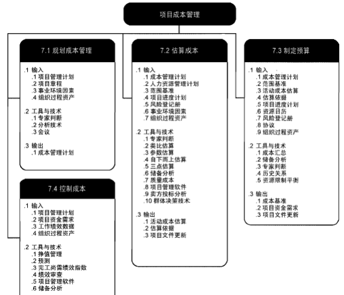
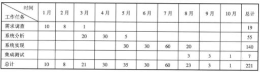
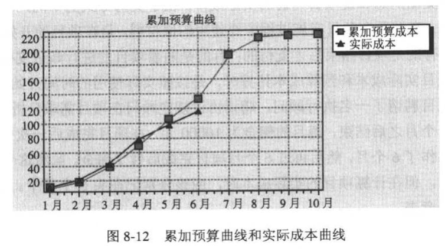
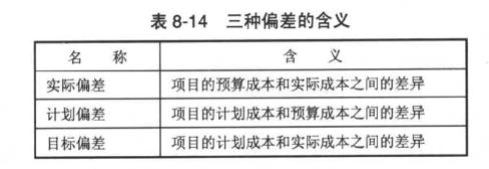
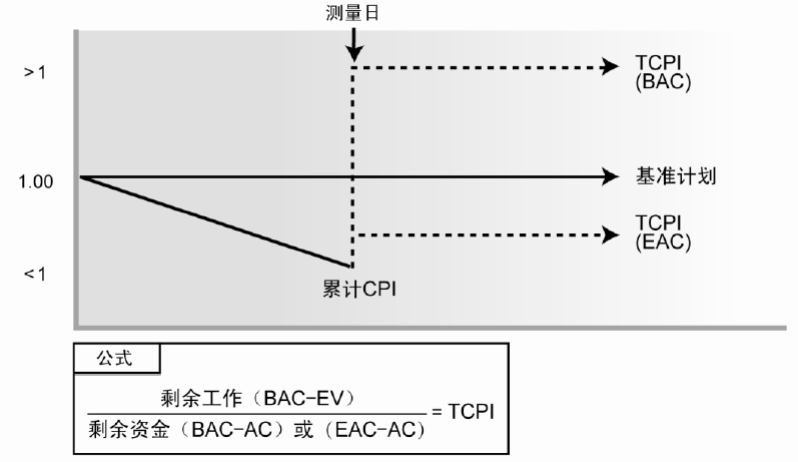

  
# 成本管理概念及相关术语
项目的成本管理要估计为了提交项目可交付成果所进行的所有任务和活动，这些任务和活动需要时间，需要资源，这些都要消耗组织的资金，只有把所有的这些成本累加，管理者才能真正了解项目的成本并进行相应的成本控制。  
成本管理并不只是把项目的成本进行监控和记录，而是需要对成本数据进行分析，以发现项目的成本隐患和问题，在项目遭受可能的损失之前采取必要的行动。  
项目的成本是项目的全过程所耗用的各种费用的总和，包括：  
+ 项目决策成本。管理决定是否实施项目要进行市场调查、查阅资料和进行可行性分析，这些都需要时间和资金。
+ 招标成本。
+ 项目实施成本。在项目开始后所发生的各种费用，包括人工费、材料费等直接成本和项目管理费等间接成本。区分：产品的全生命周期成本是产品或系统的整个使用生命期内，在获得阶段、运营与维护及生命周期结束时对产品的处置所发生的全部成本。  
## 概念
+ 成本(Cost) 项目为完成可交付成果而进行的活动所消耗资源的货币价值
+ 成本估算(Cost Estimating) 对完成项目所有活动所需要的资源的货币价值进行某种近似估计的过程或结果
+ 成本预算(Cost Budget) 根据工作分解结构的每个任务或者工作包的成本估算，计算整个项目的预算成本的过程或者结果
+ 成本基准(Cost Baseline) 经过批准的成本计划，加上或减去经过批准的成本变更
+ 成本控制(Cost Control) 对造成项目成本偏差的因素施加影响，以达到控制项目成本目的的行为和过程
+ 利润(Profits) 利润是项目的收益减去成本
+ 质量成本(Cost of Quality) 为保证质量而付出的成本
## 项目成本管理的主要活动过程
+ 制订成本管理计划：制订项目的成本结构、估算、预算和控制的标准。
+ 成本估算：完成项目活动所需资金进行近似估算的过程
+ 成本预算：汇总所有单个活动或工作包的估算成本，建立一个经批准的成本基准的过程
+ 成本控制：监督项目状态，以更新项目成本，管理成本基准变更的过程  
## 成本的类型
+ 可变成本：随着生产量、工作量或时间而变的成本
+ 固定成本：不随生产量、工作量或时间的变化而变化的非重复成本为固定成本。
+ 直接成本：直接可以归属于项目工作的成本为直接成本。如人工费、材料费、项目设备使用费等
+ 间接成本：不能或不便于直接计入某一成本计算对象，而需先按发生地点或用途加以归集，待月终选择一定的分配方法进行分配后才计入有关成本计算对象的费用，如税金、保卫费。

# 制订项目成本管理计划
制订项目成本管理计划就是生成成本管理计划，制订项目的成本结构、估算、预算和控制的标准。本过程的主要作用是，在整个项目中为如何管理项目成本提供指南和方向。  

# 项目成本估算
## 成本估算
成本估算是对项目投入的各种资源的成本进行估算，并编制费用估算书。  
要进行项目成本的估算，需要大量的数据资料，这些资料包括：  
+ 资源要求的品种和数量。
+ 每种资源的单价。
+ 每项资源占有的时间。
## 项目成本估算的困难主要在于：
+ 复杂的信息
+ 技术的变化
+ 同类项目的缺乏
+ 缺乏专业和富有经验的人才
+ 信息系统项目建设人员的不同
+ 管理层的压力与误解
## 进行项目估算时，除了要考虑项目的直接成本，还要考虑一些对成本有影响的其他因素：  
+ 非直接成本
+ 隐没成本
+ 学习曲线
+ 项目完成的时限
+ 质量要求
+ 储备（管理储备、应急储备）
## 在对项目进行成本估算时，应避免的常见错误
+ 草率的成本估算
+ 在项目范围尚未确定时就进行成本估算
+ 过于乐观或者保守的估算
## 成本估算的方法
+ 专家判断 
+ 类比估算 
+ 参数估算 
+ 自下而上的估算
+ 最小、最大和最有可能的（三点）估算
+ 储备分析
+ 质量成本 
+ 项目管理软件
+ 卖方投标分析
+ 群体决策技术

# 项目成本预算
## 成本预算概念
成本预算是在项目成本估算的基础上，将项目的成本估算分配到项目的各项具体工作上，以确定项目各项工作和活动的成本定额制定项目成本的控制标准。  
成本估算的输出结果是成本预算的基础与依据，成本预算是将已批准的项目总的估算成本进行分摊。  
（简单一句：将总费用估算分配到各单项工作上）
## 制订项目成本预算的步骤
+ 将项目总成本分摊到项目工作分解结构的各个工作包
+ 将各个工作包成本再分配到该工作包所包含的各项活动上
+ 确定各项成本预算支出的时间计划及项目成本预算计划
## 零基准预算
零基准的预算是指在项目预算中，并不以过去的同类相似的项目成本作为成本预算的基准，而是项目以零作为基准，估计所有的工作任务的成本。  
## 购买还是自己制作
为了提交项目的可交付成果，需要许多的中间产品和支持产品，这些产品既可以由组织自己生产，也可以向其他组织购买。  
如何选择，对于组织来说，是一个经济问题。组织要对比购买和自己制作之间的成本和受益的差别，做出综合性的判断。

## 累加预算成本
在项目预算中，每一个工作包都有自己的成本预算和进度计划，根据这些数据，能够确定在某个时间点上的项目所需要的资源和本，把这个时间点以前的所有成本累加的值，称为累加预算成本。累加预算成本是进行成本控制的重要依据，在项目执行的过程中，需要不断将累加预算成本和实际成本相比较，判断当前项目是否存在成本偏差。  
  
  

# 项目成本控制
项目成本控制必须和项目进度结合起来才能进行有效的控制。成本控制必须监督费用实施情况，发现实际成本和成本计划的偏差，并找出偏差的原因，防止不合理和未经批准的费用变更。    
项目实际开始实施后，就不断地消耗资金，所有雇员的工资、购买的原材料、管理成本等，这些支出的总和是项目当前的实际成本。    
由于支付方式的不同，支出发生的时间可能不同：有些在项目实施过程中要使用的原材料，是在项目的开始阶段一次性支付购买的；有的是项目结束后才支付的；有的是随着项目的进行渐进支付的。    
一般来说，在进行项目实际成本和预算成本计算时，是按照实际使用的时间开始分摊计算的。  
## 成本偏差和挣值法
偏差控制法是在计划成本的基础上，找出计划成本和实际成本之间的偏差，并分析产生偏差的原因和发展趋势，制订需要采取的减少或者消除偏差的方法。
  
## 挣值法
挣值法是一种进度测量技术，可用来估计和确定变更的程度和范围，又常被称为偏差分析法。    
挣值法通过测量和计算“已完成的工作的预算费用”、“己完成工作的实际费用”和“计划工作的预算费用”得到有关计划实施的进度和费用偏差，从而达到判断项目预算和进度计划执行情况的目的。  
### 挣值法的三个基本参数
+ 计划工作量的预算费用（BCWS PV）是指项目实施过程中某阶段计划要求完成的工作量所需的预算工时（或费用）。计算公式为：BCWS=计划工作量 x 预算定额
+ 已完成工作量的实际费用（ACWP AC）是指项目实施过程中某阶段实际完成的工作量所消耗的工时（或费用）。ACWP主要反映项目执行的实际消耗指标。
+ 己完工作量的预算成本（BCWP EV）是指项目实施过程中某阶段实际完成工作量按预算定额计算出来的工时（或费用），即挣值（Earned Value）。BCWP的计算公式为：BCWP=已完成工作量 x 预算定额  
### 挣值法的四个评价指标
+ 进度偏差(Schedule Variance,SV)是指检查日期EV与PV之间的差异，其计算公式为：SV=EV-PV
    + 当SV为正值时，表示进度提前；
    + 当SV为负值时，表示进度延误。
    + 当SV为0时，表示实际进度等于计划进度。
+ 费用偏差(Cost Variance, CV)是指检查期间EV与AC之间的差异，其计算公式为：CV=EV-AC
    + 当CV为负值时，表示实际消耗人工（或费用）超过预算值即超支;
    + 当CV为正值时，表示实际消耗人工（或费用）低于预算值，即有节余或效率高
    + 当CV等于零时，表示实际消耗人工（或费用）等于预算值。
+ 成本绩效指标(Cost Performed Index, CPI) 是指预算费用与实际费用值之比（或工时值之比），其计算公式为： CPI=EV/AC
    + 当CPI>1，表示低于预算，即实际费用低于预算费用
    + 当CPI<1,表示超出预算，即实际费用高于预算费用
    + 当CPI=1，表示实际费用与预算费用吻合
+ 进度绩效指标(Schedul Performed Index, SPI)是指项目挣得值与计划之比，其计算公式为：SPI=EV/PV
    + 当SPI>1,表示进度提前，即实际进度比计划进度快
    + 当SPI<1,表示进度延误，即实际进度比计划进度慢
    + 当SPI=1,表示实际进度等于计划进度    
### 完工估算 (EAC)
是根据项目绩效和风险量化对项目总成本的预测。EAC＝ETC+AC
### 尚未完工部分的估算 (ETC) 
即到完成项目还将需要花费多少成本。ETC＝EAC-AC ETC= (BAC-EV)/CPI，即按照当前的进展，成本的消耗情况，还需要多少费用
### 完工预算 (BAC)或称“总预算”
计算EAC时分三种情况
+ 原来的估算已经不再适合以后的情况 EAC=AC+ETC
+ 目前的偏差是特例，以后不会再发生类似偏差 EAC=AC+(BAC-EV)
+ 目前的偏差视为将来偏差的典型形式
    + 假设以当前CPI完成剩余工作： EAC=AC+(BAC-EV)/CPIEAC=BAC/CPI
    + 假设SPI与CPI将同时影响剩余工作：EAC=AC+(BAC-EV)/(CPI×SPI)
### 完工尚需绩效指数(TCPI)
TCPI是一种为了实现特定的管理目标，剩余资源的使用必须达到的成本绩效指标，是完成剩余工作所需的成本与剩余预算之比。  
TCPI是指为了实现具体的管理目标（如BAC或EAC），剩余工作的实施必须达到的成本绩效指标  
如果BAC已明显不再可行，则项目经理应考虑使用EAC进行TCPI计算。经过批准后，就用EAC取代BAC。基于BAC的TCPI公式：TCPI=(BAC–EV)/(BAC–AC)  
  
如果累计CPI低于基准，那么项目的全部剩余工作都应立即按TCPI(BAC)（图中最高的那条线）执行，才能确保实际总成本不超过批准的BAC。至于所要求的这种绩效水平是否可行，就需要综合考虑多种因素（包括风险、进度和技术绩效）后才能判断。如果不可行，就需要把项目未来所需的绩效水平调整为如TCPI(EAC)线所示。  
基于EAC的TCPI公式：TCPI=（BAC–EV）/（EAC–AC）  
## 项目成本失控的主要原因：
+ 缺乏计划
+ 目标不明
+ 范围蔓延
+ 缺乏领导力
## 控制成本主要关注两种活动
+ 当前正在进行的活动
+ 成本预算大的活动