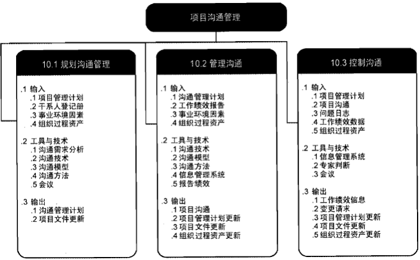
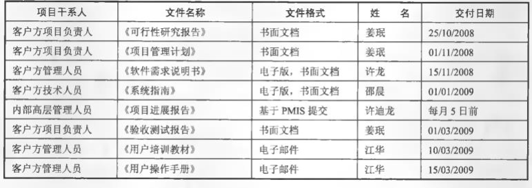
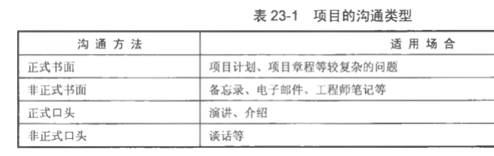

  
# 沟通的基本概念
## 沟通的定义
沟通是人与人之间、人与群体之间思想与感情的传递和反馈的过程，以求思想达成一致和感情的通畅。
## 项目过程存在的沟通
项目干系人之间的沟通贯穿整个生命周期，包括：  
+ 用户和开发商之间。需求的清晰表述、解决方案的描述、合同签订过程。
+ 团队和管理层之间。调研结果汇报、方案决策、组建团队、项目评审过程。
+ 开发团队内部。项目计划、技术方案的制订和变更。
+ 开发商和供货商之间。采购沟通、供货和验收过程。
+ 开发商和分包商之间。任务外包、提交和验收等。
## 信息系统项目成功的三个主要因素
+ 用户参与
+ 主管层的支持
+ 需求的清晰表述  
为了使项目成功，项目的每个成员都需要具备两类技能：技术技能、沟通与社交技能。  
## 沟通渠道
沟通渠道是项目中沟通的排列组合数量，就像联系所有参与者的电话线的数目一样  
计算公式如下：M=n*(n-1)/2  
M表示沟通渠道数，n表示项目中的成员数
由于沟通是需要花费项目成本的，所以应尽量控制团队规模，避免大规模团队中常常出现的沟通不畅问题  

# 制订沟通管理计划
## 沟通计划编制
是确定项目干系人的信息和沟通需求，谁需要何种信息，何时需要，以及如何向他们传递。  
沟通计划编制的第一步就是干系人分析，得出项目中沟通的需求和方式，进而形成较为准确的沟通需求表，然后再针对需求进行计划编制。  
## 沟通计划应该包括的内容
+ 干系人的沟通需求；
+ 针对沟通的信息描述，包括格式、内容、详细程度；
+ 发布信息的原因；
+ 负责沟通相关信息的人员；
+ 负责授权保密信息发布的人员；
+ 将要接收信息的个人或小组；
+ 沟通渠道的选择
+ 传递信息的技术或方法，如备忘录、电子邮件或新闻稿等；
+ 为沟通活动分配的资源，包括时间和预算；
+ 沟通频率，每周或每月。
+ 问题升级程序，用于规定下层员工无法解决问题时的上报时限和上报路径；
+ 随项目进展，对沟通管理计划进行更新与优化的方法；
+ 通用术语表；
+ 项目信息流向图、工作流程、报告清单、会议计划等；
+ 沟通制约因素，通常来自特定的法律法规、技术要求和组织政策等。
+ 沟通工作指导以及相关模板
+ 有利于有效沟通的其他方面
  

# 管理沟通
管理沟通是根据沟通管理计划，生成、收集、分发、储存、检索及最终处置项目信息的过程。本过程的主要作用是，促进项目干系人之间实现有效率且有效果的沟通。  
## 沟通方法
沟通方法有很多，根据不同的角度可以分为：  
+ 正式沟通与非正式沟通
正式沟通是通过项目组织明文规定的渠道进行信息传递和交流的方式。  
它的优点是沟通效果好，有较强的约束力，缺点是沟通速度慢。非正式沟通指在正式沟通渠道之外进行的信息传递和交流。这种沟通的优点是沟通方便，沟通速度快，且能提供一些正式沟通中难以获得的信息，缺点是容易失真。
+ 上行沟通、下行沟通和平行沟通
上行沟通是指下级的意见向上级反映，即自下而上的沟通。  
下行沟通是指管理层对员工进行的自上而下的信息沟通。  
平行沟通是指组织中各平行部门之间的信息交流。  
在项目实施过程中，经常可以看到各部门之间发生矛盾和冲突，除其他因素外，部门之间沟通不畅是重要原因之一。保证平行部门之间沟通渠道畅通，是减少部门间冲突的一项重要措施。
+ 单向沟通与双向沟通
单向沟通是一方只发送信息，另一方只接收信息的方式。  
双向沟通中，发送者和接收者两者之间的位置不断交换，且发送者是以协商和讨论的姿态面对接收者，信息发出以后还需及时听取反馈意见。  
+ 书面沟通和口头沟通
通过书面文字或口头表达语言进行沟通。
+ 言语沟通和肢体语言
肢体语言包括身体语言、面部表情和讲话声调，是项目沟通的主要组成部分。  
## 沟通类型
正式书面
非正式书面
正式口头
非正式口头
  
## 有效沟通的障碍
+ 缺乏清晰的沟通渠道；
+ 发送者与接收者存在物理距离；
+ 沟通双方彼此技术语言不通；
+ 分散注意力的环境因素(噪声)；
+ 有害的态度(敌对、不信任)；
+ 权力游戏、滞留信息、隐藏议程与敌对情绪等

# 控制沟通
控制沟通是在整个项目生命周期中对沟通进行监督和控制的过程，以确保满足项目干系人对信息的需求。  
本过程的主要作用是，随时确保所有沟通参与者之间的信息流动的最优化。  
控制沟通过程可能引发重新开展规划沟通管理或管理沟通过程。  
## 如何改进沟通
+ 使用项目管理信息系统(PMIS) 辅助沟通
+ 建立沟通基础结构
+ 使用项目沟通模板
+ 把握项目沟通基本原则
+ 发展更好的沟通技能
+ 认识和把握人际沟通风格
+ 进行良好的冲突管理
+ 召开高效的会议

沟通基础结构是一套工具、技术和原则，为项目信息传送提供一个基础。  
+ 工具包括电话机、传真机、电子邮件、项目管理信息系统、视频会议系统、文件管理系统；
+ 技术包括报告指导方针、文档模板、会议基本规则和程序、决策过程、解决问题的方法、冲突解决和协商技术及与此相似的技术；
+ 原则包括提供开放式对话的环境，使用“率直交谈” 和遵照公认的工作道德规范。

使用项目沟通模板  
为使项目日常沟通更容易，组织项目管理部门需要为一般的项目沟通建立一些范例和模板，如项目章程、绩效报告和口头状态报告等。  
把握项目沟通基本原则  
+ 沟通内外有别。
+ 非正式的沟通有助于关系的融洽
+ 采用对方能接受的沟通风格
+ 沟通的升级原则
    + 与对方沟通
    + 与对方的上级沟通
    + 与自己的上级沟通
    + 自己的上级和对方的上级沟通    
+ 扫除沟通的障碍  

发展更好的沟通技能  
在沟通和表达培训方面，很小的投资就能为个人、项目和组织带来巨大的回报，这些技能比他们在技术培训课上学到的许多技能有更长的生命力。  
多数人发现沟通技能是提升职位的关键，特别是如果他们想成为优秀的项目经理。  

认识和把握人际沟通风格  
对不同的人说同样的事会用不同的方式，原因是人们拥有不同的人际沟通风格。    
人际沟通风格可以简化为四种类型，即理想型、实践型(操纵型)、表现型(亲和型)、理性型(分析型)。

进行良好的冲突管理  
冲突管理是利用沟通技能创造性地处理项目冲突的艺术。冲突管理的作用是引导这些冲突的结果向积极的、协作的而非破坏性的方向发展。  
项目经理要认识到并非所有的冲突都是有害的，有些有利的。  

召开高效的会议  
会议是项目沟通的一种重要形式。  
许多人抱怨他们的时间浪费在一些不必要的或者缺乏计划的、糟糕的会议上  
对于人员工资相对较高的信息系统行业，低效会议的机会成本是相当大的。  

## 如何开好会议
+ 事先制订一个例会制度；
+ 放弃可开可不开的会议；
+ 明确会议的目的和期望的结果；
+ 发布会议通知；
+ 在会议前将会议资料发给参会人员；
+ 可以借助视频设备；
+ 明确会议议程和规则（指定主持人并明确其职责)
+ 会议要有纪要，会议后要总结；
+ 做好会议的后勤保障。