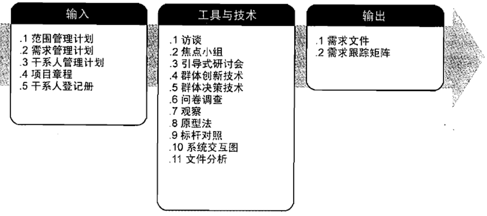
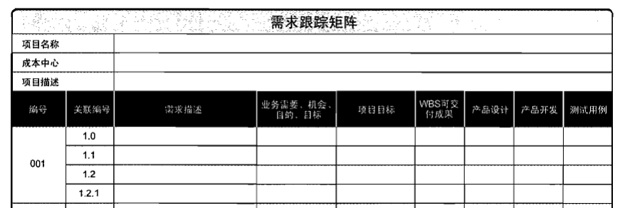
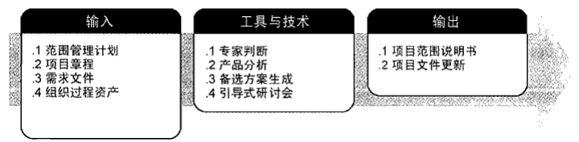
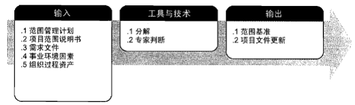
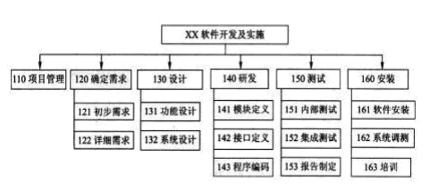
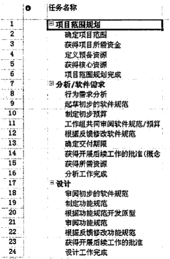

# 项目范围管理概念
项目的范围管理会影响到信息系统项目的成功。在实践中，“需求蔓延”是信息系统失败最常见的原因之一。  
信息系统项目往往在项目启动、计划、执行甚至收尾时不断加入新功能，无论是客户的要求还是项目实现人员对新技术的试验，都可能导致信息系统项目范围的失控，从而使信息系统项目在时间、资源和质量上都受到严重影响。  
## “需求蔓延” 的原因
+ 项目组也从来不知道项目的范围是什么，什么是项目应该做的，什么是项目不应该做的。
+ 项目组从来没有使用任何有效方式和过程来控制范围的变化。
## 项目范围的概念
项目范围是为了达到项目目标，为了交付具有某种特制的产品和服务，项目所规定要做的。  
信息系统项目中，实际上存在两个相互关联的范围：产品范围和项目范围。  
+ 产品范围是指信息系统产品或者服务所应该包含的功能；
+ 项目范围是指为了能够交付信息系统项目所必须做的工作。显然，产品范围是项目范围的基础。 
## 项目范围对项目管理的意义
+ 清楚项目工作范围和内容，为准确估算费用、时间和资源打下基础；
+ 为各项计划打下基础，是项目进度测量和控制基准；
+ 确定具体工作任务，有助于划分责任和分派任务
## 项目范围管理的主要过程
+ 编制范围管理计划
+ 收集需求
+ 定义范围
+ 创建工作分解结构
+ 确认范围
+ 范围控制

# 编制范围管理计划和范围说明书
## 范围计划编制
项目范围管理计划是一种规划的工具，说明项目组将如何进行项目的范围管理。具体来说，包括如何进行项目范围定义、如何制订工作分解结构、如何进行项目范围核实和控制等。

## 编制范围管理计划的工具和技术
+ 专家判断
+ 会议
## 编制范围管理计划的输出
+ 范围管理计划
+ 需求管理计划
  
### 范围管理计划
范围管理计划是项目或项目集管理计划的组成部分，描述将如何定义、制定、监督、控制和确认项目范围。对将用于下列工作的管理过程做出规定：  
+ 制定详细项目范围说明书；
+ 根据详细项目范围说明书创建WBS；
+ 维护和批准WBS；
+ 正式验收已完成的项目可交付成果；
+ 处理对详细项目范围说明书的变更。该工作与实施整体变更控制过程直接相联
### 需求管理计划
需求管理计划描述将如何分析、记录和管理需求。需求管理计划的主要内容包括（但不限于）：
+ 如何规划、跟踪和报告各种需求活动；
+ 配置管理活动，例如，如何启动产品变更，如何分析其影响，如何进行追溯、跟踪和报告，以及变更审批权限；
+ 需求优先级排序过程；
+ 产品测量指标及使用这些指标的理由；
+ 用来反映哪些需求属性将被列入跟踪矩阵的跟踪结构。

# 收集需求
收集需求是为实现项目目标而确定、记录并管理干系人的需要和需求的过程。本过程的主要作用是，为定义和管理项目范围（包括产品范围）奠定基础。  
  
## 需求的分类
需求可以分成不同的类别，有利于对需求进行进一步完善和细化
+ 业务需求。整个组织的高层级需要，例如，解决业务问题或抓住业务机会，以及实施项目的原因。
+ 干系人需求。干系人或干系人群体的需要。
+ 解决方案需求。为满足业务需求和干系人需求，产品、服务或成果必须具备的特性、功能和特征。
    + 功能需求是产品能开展的行为。如流程、与产品的互动。
    + 非功能需求是对功能需求的补充，是产品正常运行所需的环境条件或质量。如可靠性、性能、安全性、服务水平等
+ 过渡需求。从“当前状态”过渡到“将来状态”所需的临时能力，如数据转换和培训需求。
+ 项目需求。项目需要满足的行动、过程或其他条件。
+ 质量需求。用于确认项目可交付成果的成功完成或其他项目需求的实现的任何条件或标准。
## 收集需求的工具和技术
+ 访谈
+ 焦点小组
+ 引导式研讨会
+ 群体创新技术
+ 群体决策技术
+ 问卷调查
+ 观察
+ 原型法
+ 标杆对照
+ 系统交互图
+ 文件分析
 
## 收集需求的输出
+ 需求文件
+ 需求跟踪矩阵
### 需求跟踪
需求跟踪的目的是建立与维护“需求－设计－编程－测试”之间的一致性，确保所有的工作成果符合用户需求。需求跟踪有两种方式：  
+ 正向跟踪。检查《产品需求规格说明书》中的每个需求是否都能在后继工作成果中找到对应点。
+ 逆向跟踪。检查设计文档、代码、测试用例等工作成果是否都能在《产品需求规格说明书》中找到出处。正向跟踪和逆向跟踪合称为“双向跟踪”。不论采用何种跟踪方式，都要建立与维护需求跟踪矩阵（即表格）。需求跟踪矩阵保存了需求与后继工作成果的对应关系。  
### 需求跟踪矩阵
需求跟踪矩阵是把产品需求从其来源连接到能满足需求的可交付成果的一种表格。  
使用需求跟踪矩阵，可以把每个需求与业务目标或项目目标联系起来，有助于确保每个需求都具有商业价值。  
需求跟踪矩阵提供了跟踪需求的一种方法，有助于确保需求文件中被批准的每项需求在项目结束的时候都能交付
  

# 范围定义
范围定义是制定项目和产品详细描述的过程。  
范围定义明确所收集的需求哪些将包含在项目范围内，哪些将排除在项目范围外，从而明确项目范围边界。  
范围定义最重要的任务就是详细定义项目的范围边界。  
项目小组应该把工作时间和资源放在范围边界之内的工作上。如果相反，把精力和时间放在项目范围边界之外的工作上，那么得到的回报将非常少。  
## 范围定义的过程
 
## 项目范围说明书
项目范围说明书是对项目范围、主要可交付成果、假设条件和制约因素的描述。项目范围说明书记录了整个范围，包括项目范围和产品范围。  
项目范围说明书详细描述项目的可交付成果，以及为创建这些可交付成果而必须开展的工作。

# 创建工作分解结构
## 创建工作分解结构（WBS）
创建工作分解结构是一个把项目可交付物和项目工作逐层分解为更小的、更易于管理的项目单元的过程，它组织并定义了整个项目范围。  
项目的工作分解结构( WBS)是管理项目范围的基础，详细描述了项目所要完成的工作  
工作分解结构是将项目划分为可管理的工作单元，以便这些工作单元的费用、时间和其他方面较项目整体而言较容易确定。  
工作分解结构对于所有的项目都非常重要，因为它是费用估算、进度估算、资源计划、风险管理计划、活动定义的基础和依据。
  
## 工作分解结构的目的和用途
+ 明确和准确说明项目范围，项目组成员能够清楚地理解任务的性质和需要努力的方向。
+ 工作分解结构清楚地定义了项目的边界确定项目需要做的工作和不需要做的工作。
+ 为各独立单元分派人员，可以确定完成项目所需要的技术和人力资源。
+ 针对独立单元，进行时间、费用和资源的需要量的估算，提高估算的准确性。
+ 项目进度控制的基准。
+ 将项目工作和项目的财务账目联系起来。
+ 确定工作内容和工作顺序。
+ 估计项目整体和全过程的费用。
+ 工作分解结构有助于防止需求蔓延。
## 工作分解结构的层次
工作分解结构把项目整体或者主要的可交付成果分解成容易管理、方便控制的若干个子项目或者工作包，子项目需要继续分解为工作包，持续这个过程，直到整个项目都分解为可管理的工作包，这些工作包的总和是项目的所有工作范围。  
+工作包的大小也是需要考虑的细节，如果工作包太大，那么难以达到可管理和可控制的目标，如果工作包太小，那么工作分解结构就要消耗项目管理者和项目组成员的大量时间和精力。
+ 作为一种经验法则，8/80规则建议工作包的大小应该至少需要8小时来完成，而总完成时间也不应该大于80小时（两周）。  
## WBS的表示形式
WBS 一般有两种表示形式：
### 分级的树型结构
  
### 列表形式类似于书籍的分级目录，最好是直观的缩进格式
  
# 项目范围确认
# 项目范围控制