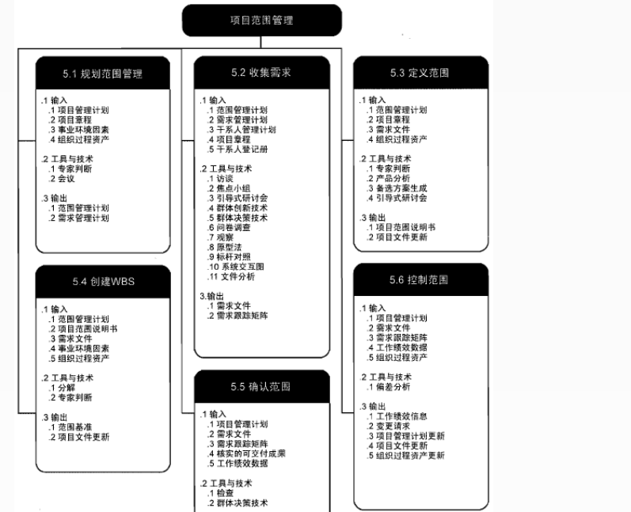
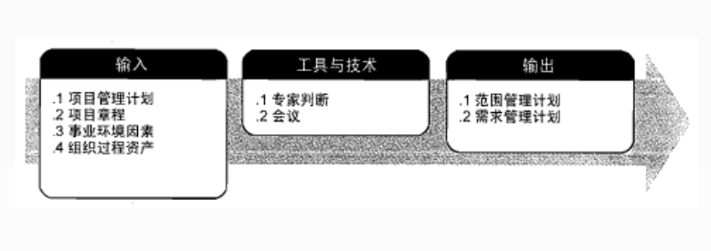
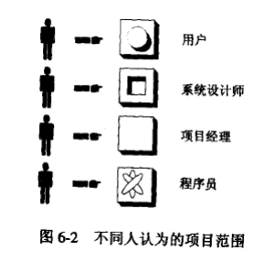
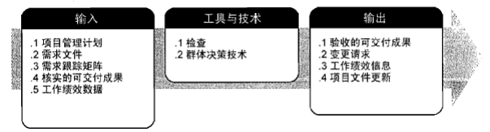
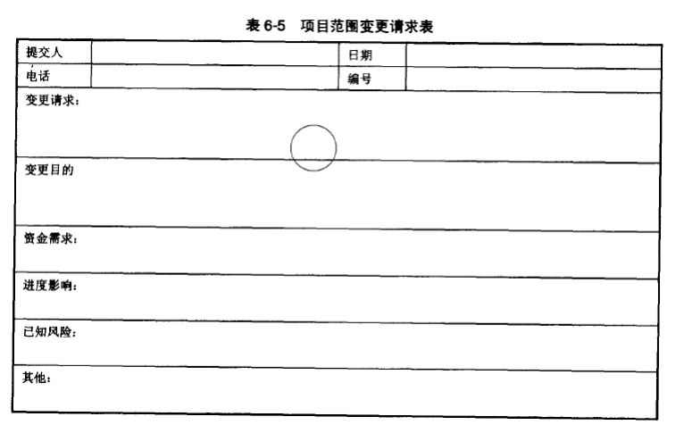
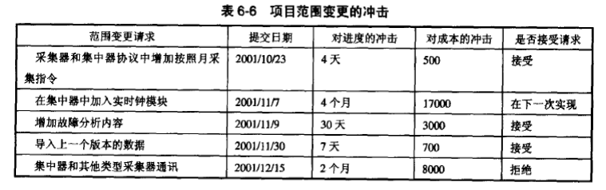

# 项目范围管理概念
项目的范围管理会影响到信息系统项目的成功。在实践中，“需求蔓延”是信息系统失败最常见的原因之一。  
信息系统项目往往在项目启动、计划、执行甚至收尾时不断加入新功能，无论是客户的要求还是项目实现人员对新技术的试验，都可能导致信息系统项目范围的失控，从而使信息系统项目在时间、资源和质量上都受到严重影响。  
## “需求蔓延” 的原因
+ 项目组也从来不知道项目的范围是什么，什么是项目应该做的，什么是项目不应该做的。
+ 项目组从来没有使用任何有效方式和过程来控制范围的变化。
## 项目范围的概念
项目范围是为了达到项目目标，为了交付具有某种特制的产品和服务，项目所规定要做的。  
信息系统项目中，实际上存在两个相互关联的范围：产品范围和项目范围。  
+ 产品范围是指信息系统产品或者服务所应该包含的功能；
+ 项目范围是指为了能够交付信息系统项目所必须做的工作。显然，产品范围是项目范围的基础。 
## 项目范围对项目管理的意义
+ 清楚项目工作范围和内容，为准确估算费用、时间和资源打下基础；
+ 为各项计划打下基础，是项目进度测量和控制基准；
+ 确定具体工作任务，有助于划分责任和分派任务
## 项目范围管理的主要过程
+ 编制范围管理计划
+ 收集需求
+ 定义范围
+ 创建工作分解结构
+ 确认范围
+ 范围控制

# 编制范围管理计划和范围说明书
## 范围计划编制
项目范围管理计划是一种规划的工具，说明项目组将如何进行项目的范围管理。具体来说，包括如何进行项目范围定义、如何制订工作分解结构、如何进行项目范围核实和控制等。

## 编制范围管理计划的工具和技术
+ 专家判断
+ 会议
## 编制范围管理计划的输出
+ 范围管理计划
+ 需求管理计划

# 收集需求
# 范围定义
# 创建工作分解结构

# 项目范围确认
## 范围确认
范围确认是确认项目的可交付成果和用户的期望是否一致。  
范围确认应该贯穿项目的始终，从WBS的确认或合同中具体分工界面的确认，到项目验收时范围的检测。   
在信息系统中，范围确认并不是容易的事情，它的不容易主要体现在与用户的沟通上。  
  
范围确认主要是项目利益相关人员（客户、投资人等）对项目的范围进行确认和接受的工作。  
每个人对项目范围所关注的方面是不同的。  
+ 管理层所关注的是项目范围对项目的进度、资金和资源的影响
+ 客户主要关心的是产品的范围，关心项目的可交付成果是否足够完成产品或者服务。
  
## 项目利益相关人进行范围确认时，要检查：
+ 可交付成果是否是确实的、可核实的。
+ 每个交付成果是否有明确的里程碑，里程碑是否有明确的、可辨别的事件。
+ 是否有明确的质量标准。
+ 审核和承诺是否有清晰的表达。所有的这些表达必须清晰，并取得一致的同意。
+ 项目范围是否覆盖了需要完成的产品或者服务进行的所有活动，有没有遗漏或者错误。
+ 项目范围的风险是否太高，管理层是否能够降低可预见的风险发生时对项目的冲击。

+ 如果在范围确认工作中发现项目范围说明书、工作分解结构中有遗漏或者错误，需要向项目组明确指出错误的内容，并给出修正的意见。项目组需要根据修改意见重新修改项目范围说明书和工作分解结构。
+ 在范围确认的工作过程中也可能会出现范围变更请求，如果这些范围变更请求得到了批准，那么也要重新修改项目范围说明书和工作分解结构。  
## 范围确认采用的方法
### 检查
是指开展测量、审查与确认等活动，来判断工作和可交付成果是否符合需求和产品验收标准。是否满足干系人要求和期望。  
### 群体决策技术
群体决策就是为达成某种期望结果而对多个未来行动方案进行评估。群体决策技术可用来开发产品需求，以及对产品需求进行归类和优先排序。  
+ 一致同意。每个人都同意某个行动方案。
+ 大多数原则。获得群体中50%以上的人的支持。
+ 相对多数原则。根据群体中相对多数者的意见做出决定，即便未能获得一部分人的支持。
+ 独裁。某个人为群体做出决策。

# 项目范围控制
控制范围是监督项目和产品的范围状态，管理范围基准变更的过程。范围控制涉及到影响范围变更的因素，确保所有变更请求、推荐的纠正措施或预防措施按照项目整体变更控制处理。  
## 范围变更的原因
+ 项目外部环境发生变化（如法律、对手的新产品)
+ 范围计划不周
+ 有错误或者遗漏
+ 出现了新的技术、手段和方案
+ 项目实施组织发生了变化
+ 项目业主对项目要求发生变化等。
+ 所有的变更必须记载，范围控制必须能够对造成范围变更的因素施加影响，估算对项目的资金、进度和风险等影响，以保证变化是有利的，同时需要判断范围变更是否发生，如果已经发生，那么对变化进行管理。
+ 信息系统项目建设过程中用户不断提出的新的要求和建议，项目应该坚持“决不让步，除非交换” 的原则，尽可能减少范围蔓延的可能性。
+ 所有的范围变更必须在项目的工期、费用或者质量要求上有相应的变更。
## 范围变更请求
+ 范围变更的原因是多方面的
+ 范围的变化是必然的，项目组无法阻止变化，也不能完全预言变化
+ 虽然许多新的分析方法能够容纳一些变化，但它们并非解决信息系统复杂性的“银弹”，根本原因就在于信息系统的复杂性。  
 
## 范围变更的冲击
  
## 变更请求的回应
+ 可以实现，并且能够满足现有的进度、资金和资源限制。这是最好的情况，也是最少的情况。
+ 可以实现，但是需要更多的时间、成本。
+ 难以实现，如果要实现，必须付出极大的代价。如果不是必需的，应该拒绝这样的变更请求。
+ 无法实现，非常遗憾。
## 变更控制系统
变更控制系统是文档化的，以正式的过程来接受、审查和允许项目的变更请求。  
变更控制系统定义了变更请求对资金、进度的冲击，变更的风险估计，同时记录了拒绝变更的方法。  
在许多组织中，变更控制系统拥有一个变更控制委员会（CCB），由这个委员会来完成审核和评审提交的变更请求，估计他们的价值，批准或者拒绝项目变更请求，或者推迟请求等对项目变更请求的建议。 
## 实现范围变更
+ 项目的初期改变项目的范围要比后期容易
+ 避免信息系统项目范围在项目进行后进行重大修改，合理的需求分析非常重要
+ 不要把项目变成新技术的测试平台。如果有必要，在组织中建立专门的实验室是非常好的解决方法。
+ 范围变更需要及时告知项目的相关利益人
范围变更后还要对工作分解结构进行修改，这个修改往往会影响到项目的费用、时间、产品质量和需要使用的资源  
  
我们需要把变更需求产生的原因、进行纠正行为的理由和产生的结果，以及其他有关范围变更的经验教训都应该记录在册
