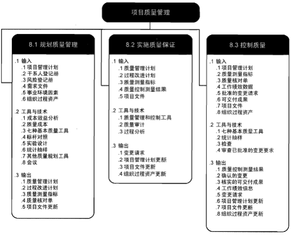
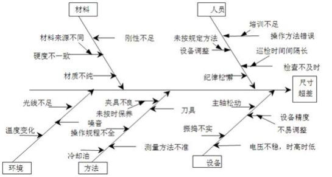
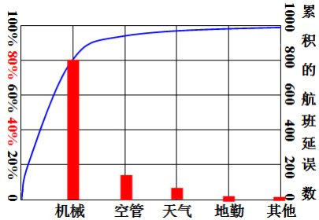
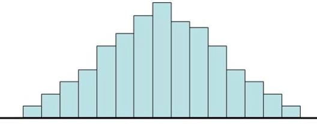
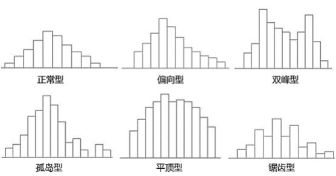
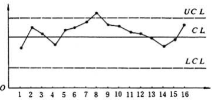
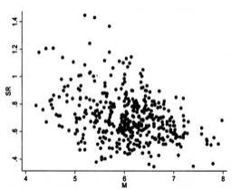
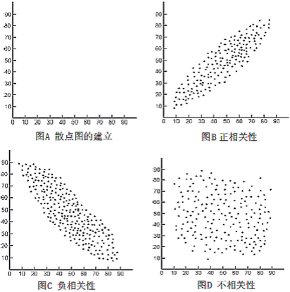
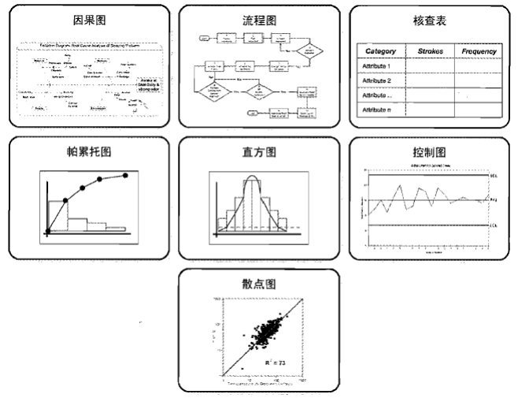
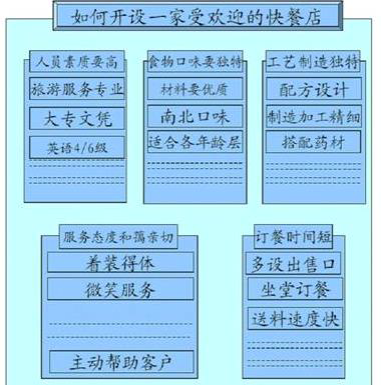

  
# 项目质量管理概论
## 质量的概念
在软件产品中，满足给定需求的各种特性的总和。这些特性称为质量特性，包括功能度、可靠性、时间经济性、资源经济性、可维护性和移植性等。  
包括明示的、隐含的和必须履行的需求或期望。
+ 明示的是指在合同环境中，用户明确提出的需要或要求，通常是通过合同、标准、规范、图纸、技术文件所做出的明确规定；
+ 隐含是指顾客的期望，是指那些人们公认的、不言而喻的、不必作出规定的“需要”。
+ 必须履行的要求：指法律法规的要求、强制性标准的要求。
## 质量管理的概念
是在质量方面指挥和控制组织协调的活动，包括制订质量方针、质量目标、责任的所有工作，以及通过质量系统中的质量计划、质量保证、质量控制和质量提高等手段来实施这些工作。 
## 质量保证的概念
“质量保证是质量管理的一部分，致力于增强满足质量要求的能力”。也就是，质量保证是为了提供足够的信任，表明实体能够满足质量要求，而在质量体系中实施并根据需要进行全部有计划和有系统的活动。  
## 质量控制的概念
是质量管理的一部分，致力于满足质量要求。质量控制的目标就是确保产品的质量能满足顾客、法律法规等方面所提出的质量要求。  
## 质量管理主要活动过程
+ 质量计划的编制是指确定与项目相关的质量标准，并决定如何达到这些质量标准。
+ 质量保证期评估总体项目绩效的活动之一，以树立项目能满足相关质量标准的信心。
+ 质量控制监控具体的项目结果以判断其是否符合相关的质量标准，并确定方法来消除绩效低下的原因，它应该贯穿于项目的全过程。
 
# 规划质量管理
规划质量管理是识别项目及其可交付成果的质量要求和标准，并书面描述项目将如何证明符合质量要求的过程。  
编制一份清晰的质量管理计划是实施项目质量管理的第一步，而一个清晰的质量管理计划首先需要明确以下两点：  
+ 明确将采用的质量标准
+ 明确质量目标质量政策和质量标准往往是编制质量管理计划的约束条件，并来自项目组织之外。
+ 质量政策可能来自项目执行组织高层的战略规划
+ 质量标准可能来自强制性的行业标准或国家标准等
## 制定项目质量计划的技术和工具
+ 效益/成本分析
+ 质量成本法
+ 标杆对照
+ 实验设计
+ 其它质量管理工具

# 实施质量保证
## 质量保证的概念
质量保证是为了提供足够的信任表明实体能够满足质量要求，而在质量体系中实施并根据需要进行全部有计划和有系统的活动。  
## 管理过程的质量保证
质量保证活动的基本内容如下：
+ 制定质量标准
+ 制定质量控制流程
+ 提出质量保证所采用方法和技术
+ 建立质量体系的评估
## 质量保证方法与工具
+ 质量审计 是对具体质量管理活动的结构性的评审。质量审计可以是事先安排的，也可以是随机进行的。可由内部审计师或第三方进行。
+ 过程分析 是指按照过程改进计划中概括的步骤来识别所需的改进。过程分析包括根本原因分析——用于识别问题、探究根本原因，并制定预防措施的一种具体技术。

# 质量控制
项目质量控制(QC)就是项目团队的管理人员采取有效措施，监督项目的具体实施结果，判断它们是否符合项目有关的质量标准，并确定消除产生不良结果原因的途径。  
也就是说进行项目质量控制是确保项目质量计划和目标得以圆满实现的过程。
## 项目质量控制的技术和工具
### 老七种工具
+ 因果图 又称鱼骨图、石川图，是一种发现问题“根本原因”的分析方法。问题陈述放在鱼骨的头部，作为起点，用来追溯问题来源，回推到可行动的根本原因。
  
+ 流程图 
+ 检查表 又称计数表，是用于收集数据的查对清单。它合理排列各种事项，以便有效地收集关于潜在质量问题的有用数据。在开展检查以识别缺陷时，用核查表收集属性数据就特别方便。用核查表收集的关于缺陷数量或后果的数据，又经常使用帕累托图来显示。
+ 帕累托图 是一种特殊的垂直条形图，用于识别造成大多数问题的少数重要原因。在横轴上所显示的原因类别，作为有效的概率分布，涵盖100%的可能观察结果。  
  
+ 直方图 是一种特殊形式的条形图，用于描述集中趋势、分散程度和统计分布形状。与控制图不同，直方图不考虑时间对分布内的变化的影响。
    
+ 控制图 用来确定一个过程是否稳定，或者是否具有可预测的绩效。根据协议要求而制定的规范上限和下限，反映了可允许的最大值和最小值，超出规范界限就可能受处罚。控制图可用于监测各种类型的输出变量。也可用来监测成本与进度偏差、产量。  

+ 散点图 又称相关图，标有许多坐标点（X,Y），解释因变量Y相对于自变量X的变化。相关性可能成正相关、负相关或不存在（零相关）  
    
  

### 新七种工具
+ 亲和图 把大量收集到的事实、意见或构思等语言资料，按其相互亲和性（相近性）归纳整理这些资料，使问题明确起来，求得统一认识和协调工作，以利于问题解决的一种方法  
  
+ 过程决策程序图 是在制定计划阶段或进行系统设计时，事先预测可能发生的障碍（不理想事态或结果），从而设计出一系列对策措施以最大的可能引向最终目标（达到理想结果）。该法可用于防止重大事故的发生，因此也称之为重大事故预测图法。
+ 关联图
+ 树形图
+ 优先矩阵
+ 活动网络图
+ 矩阵图 
## 测试
测试是项目质量控制过程的重要组成部分，是用来确认一个项目的品质或性能是否符合需求说明书的要求。  
软件测试就是在软件投入运行前，对软件需求分析、设计规格说明和编码的最终复审，是软件质量控制的关键步骤。  
## 检查
检查是指对工作产品进行检视来判断是否符合预期标准。一般来说，检查的结果包含有度量值。  
检查可在任意工作层次上进行，可以检查单个活动，也可以检查项目的最终产品。  
检查也被叫做评审，同行评审，审计或者走查。
## 统计抽样
统计抽样指从感兴趣的群体中选取一部分进行检查适当的抽样可以降低质量控制费用。