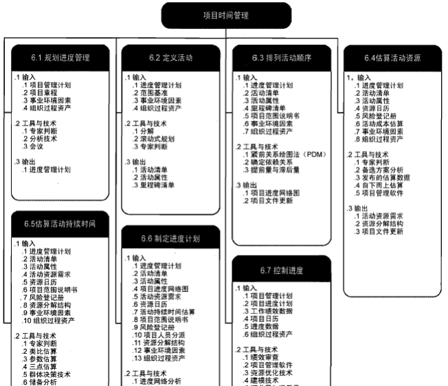  
项目管理的首要任务是制订一个构思良好的项目计划，以确定项目的范围、进度和费用。由于在给定时间内完成项目是项目的重要约束性目标，能否按进度交付是衡量项目是否成功的重要标志。  
# 规划项目进度管理
规划进度管理是为规划、编制、管理、执行和控制项目进度而制定政策、程序和文档的过程。本过程的主要作用是，为如何在整个项目过程中管理项目进度提供指南和方向。  
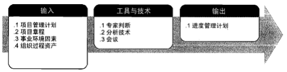  

# 定义活动
工作分解结构的最底层是工作包，把工作包分解成更小的组成部分，就是活动。  
+ 活动：为得到工作分解结构（WBS）中最底层的交付物需要进行的工作。
+ 活动定义过程就是要把完成项目的所有活动都找出来。
+ 活动定义除识别出项目的所有活动外，还要对这些活动进一步定义，如名称、前序活动、后继活动、资源要求、是否有强制日期等，最后把所有活动归档到活动清单中
## 定义活动的工具和技术
### 分解
分解是一种把项目范围和项目可交付成果逐步划分为更小、更便于管理的组成部分的技术。  
WBS中的每个工作包都需分解成活动，以便通过这些活动来完成相应的可交付成果。让团队成员参与分解过程，有助于得到更好、更准确的结果  
### 滚动式规划
滚动式规划是一种迭代式规划技术，即详细规划近期要完成的工作，同时在较高层级上粗略规划远期工作。  
滚动式规划是一种渐进明细的规划方式。因此，在项目生命周期的不同阶段，工作的详细程度会有所不同。在早期的战略规划阶段，信息尚不够明确，工作包只能分解到已知的详细水平；而后，随着了解到更多的信息，近期即将实施的工作包就可以分解到具体的活动  
### 里程碑
#### 检查点
指在规定的时间间隔内对项目进行检查，比较实际与计划之间的差异，并根据差异进行调整。  
可将检查点看作是一个固定“采样”时点，而时间间隔根据项目周期长短不同而不同，间隔太大会失去意义，间隔太小会增加管理成本。常见的间隔是每周一次，项目经理需要召开例会并上交周报
#### 里程碑
里程碑是项目中的重大事件，是一个时间点，在项目过程中不占资源，通常指一个可交付成果的完成。是完成阶段性工作的标志。  
#### 基线
指一个（或一组）配置项在项目生命周期的不同时间点上通过正式评审而进入正式受控的一种状态。  
基线其实是一些重要的里程碑，但相关交付物要通过正式评审，并作为后续工作的基准和出发点。基线一旦建立后其变化需要受控制。  

# 排列活动顺序
## 活动排序
活动排序是指明确各活动之间的逻辑关系和先后顺序。按逻辑关系为计划的活动排序，除第一和最后一个之外的每一个活动，都至少与一个前序活动和一个后继活动相关联。排序可以由项目管理软件、手动或者自动化工具来完成  
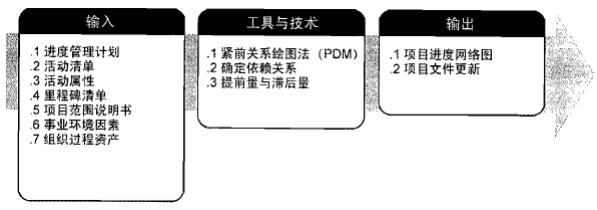  
## 活动排序的工具与技术
## 前导图法（PDM）
前导图法也叫单代号网络图，是用于编制项目进度网络图的一种方法，它使用方框或者长方形（被称作节点）代表活动，它们之间用箭头连接，显示它们之间逻辑关系  
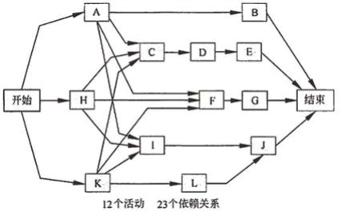  
在前导图法中，每项活动有唯一的活动号，每项活动都注明了预计工期。通常，每个节点会有如下几个时间：  
+ 最早开始时间(ES)
+ 最迟开始时间(LS)
+ 最早结束时间(EF)
+ 最迟结束时间(LF)
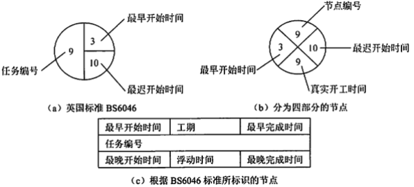  
这些时间点通常作为节点的组成部分。  
前导图法中，项目活动间存在四种依赖关系：  
+ 结束--开始关系(F-S型)。前序活动结束后，后续活动才能开始。
+ 结束--结束关系(F-F型)。前序活动结束后，后续活动才能结束。
+ 开始--开始关系(S-S型)。前序活动开始后，后续活动才能开始。
+ 开始--结束关系(S-F型)。前序活动开始后，后续活动才能结束。
## 箭线图法（ADM）
箭线图也称为双代号网络图，用箭线表示工作，节点表示工作的逻辑关系。  
+ 箭线：使用箭线表示工作，箭线都需要占用时间，消耗资源。
+ 虚箭线：为了正确表达工作之间的逻辑关系，而虚设的一项并不存在的工作，因此不占用资源，不消耗时间。
+ 节点：反映的是前后工作的交接点，体现了各工作之间的逻辑关系。
### 网络图的绘制规则
+ 网络图必须按照已定的逻辑关系绘制。
+ 网络图中严禁出现环路。
+ 网络图中的箭线(包括虚箭线)应保持自左向右的方向，不应出现箭头指向左方的水平箭线和箭头偏向左方的斜向箭线。
+ 节点编号顺序应从小到大，可不连续，但严禁重复。一项工作应只有唯一的一条箭线和相应一对节点编号，箭尾的
+ 节点编号应小于箭头的节点编号。
+ 应尽量避免网络图中工作箭线的交叉。当交叉不可避免时，可以采用过桥法或指向法处理
### 依赖关系
+ 强制性依赖关系。指工作内在性质所固有的，或法律、合同中要求的依赖关系。强制性依赖关系又称硬逻辑关系。
+ 选择性依赖关系。有时叫做首选逻辑关系、优先逻辑关系或者软逻辑关系。通常是某个具体应用领域最好做法，或者是因为项目的特殊性质而设定的。即使有其他顺序可以采纳，但仍希望按照此顺序安排活动。
+ 外部依赖关系。外部依赖关系是指项目活动和非项目活动之间关系的依赖关系。这些依赖关系往往不在项目团队控制范围内。例如，软件项目测试活动的进度可能取决于来自外部的硬件是否到货；施工项目的场地平整，可能要在环境听证会之后才能动工。
+ 内部依赖关系。内部依赖关系是项目活动之间的紧前关系，通常在项目团队的控制之中。 
#### 提前量和滞后量
+ 提前量是相对于紧前活动，紧后活动可以提前的时间量。提前量往往表示为负数。
+ 不同于进度压缩技术中的快速跟进，提前量是活动本身允许的，不存在引入风险的问题，而快速跟进是把本应顺序执行的活动部分或全部并行，以压缩时间，这有可能造成返工和风险增加。
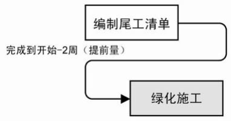  
+ 滞后量是相对于紧前活动，紧后活动需要推迟的时间量。滞后量往往表示为正数。
+ 在估算活动持续时间时，不应包含任何活动的滞后量。例如，某活动持续时间3天外加2天的滞后量，则该活动历时就是3天，不能计算为5天。
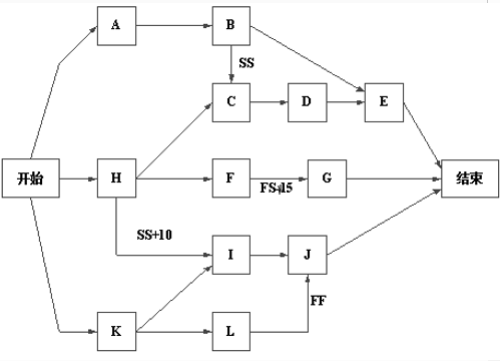

# 估算活动资源
估算活动资源就是确定在实施项目活动时要使用何种资源（人员、设备或物资），每种资源的数量，以及何时使用。  
## 估算活动资源所采用的主要方法和技术
+ 专家判断法
+ 备选（替代）方案
+ 公开的估算数据
+ 项目管理软件（估算软件）
+ 自下而上估算
## 估算活动资源的输出
### 活动资源需求
活动资源需求明确了工作包中每个活动所需的资源类型和数量，然后，把这些需求汇总成每个工作包或每个工作时段的资源估算。  
在活动资源需求文件中，应说明每一种资源的估算依据，以及为确定资源类型、可用性和所需数量而做出的假设。
### 资源分解结构(RBS)
资源分解结构是按照资源种类和形式而划分的资源层级结构，资源类别包括人力、材料、设备和用品。  
它是项目分解结构的一种，通过它可以在资源需求细节上制定进度计划，并可以通过汇总的方式向更高一层汇总资源需求和资源可用性。
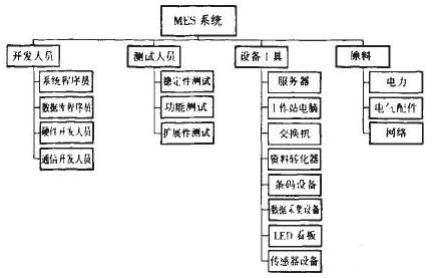  

# 估算活动持续时间
##活动历时估算 
活动历时估算是估算计划活动持续时间的过程。它根据活动对应的工作范围、需要的资源类型和资源数量及相关的资源日历信息，来估算活动历时。  
## 活动历时估算主要方法和技术
+ 专家判断
+ 类比估算 是一种使用相似活动或项目的历史数据，来估算当前活动或项目的持续时间或成本的技术。是一种粗略的估算方法，成本低，耗时少，但准确性也较低。
+ 参数估算 参数估算是指利用大量项目的历史数据拟合出估算模型，以规模、可靠性、复杂度、开发人员的能力等因子作为参数，来估算项目的成本、工作量和持续时间。
+ 三点法估算
    + 乐观时间（optimistic time)---任何事情都顺利的情况下，完成某项工作的时间。
    + 最可能时间（most likely time)---正常情况下，完成某项工作的时间。
    + 悲观时间（pessimistic time)---最不利的情况下，完成某项工作的时间。
可算出每个活动的期望ti
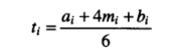  
ai表示第i项活动的乐观时间，mi 表示第i项活动的最可能时间，bi表示第i项活动的悲观时间。
+ 群体决策技术
+ 储备分析
## 储备分析
应急储备的特点：
+ 用来处理预期但不确定的事件（已知的未知）；
+ 是时间（成本）绩效基准的一部分；
+ 项目经理可以自由使用；
+ 作为预算分配；（成本估算 + 应急储备 = 项目完工预算，项目完工预算+ 管理储备 = 项目总资金需求）
+ 是挣值计算的一部分。
管理储备的特点：
+ 用来处理非预期且不确定的事件（未知的未知）；
+ 不属于时间（成本）绩效基准；
+ 动用之前一般需要获得批准；
+ 不作为预算分配；
+ 不是挣值计算的一部分。

# 制订进度计划
制定项目进度计划要确定项目活动的开始与完成日期。进度计划、历时估算、费用估算等过程交织在一起，这些过程反复多次，最后才能确定项目进度计划。  
## 制订进度计划采用的主要方法和技术
+ 进度网络分析
+ 关键路径法
+ 关键链法
+ 资源优化技术
+ 建模技术
+ 提前量和滞后量
+ 进度压缩
### 关键路径法(CPM)
是借助网络图和各活动所需时间，计算每一活动的最早或最迟开始和结束时间。    
CPM算法的核心思想是将工作分解结构(WBS)分解的活动按逻辑关系加以整合，统筹计算出整个项目的工期和关键路径。  
每个活动有四个和时间相关的参数：  
+ 最早开始时间（ES)。某项活动能够开始的最早时间。
+ 最早结束时间（EF)。某项活动能够完成的最早时间。EF=ES+工期估计
+ 最迟结束时间（LF)。为了使项目按时完成，某项工作必须完成的最迟时间。
+ 最迟开始时间（LS)。为了使项目按时完成，某项工作必须开始的最迟时间。LS=LF-工期估计  
计算出工程的最早完工时间。通过正向计算（从第一个活动到最后一个活动）推算出最早完工时间，步骤如下：  
+ 从网络图始端向终端计算。
+ 第一任务的开始为项目开始。
+ 任务完成时间为开始时间加持续时间（工期）。
+ 后续任务的开始时间根据前置任务的时间和搭接时间而定。
+ 多个前置任务存在时，根据最迟任务时间来定。
通过反向计算（从最后一个活动到第一个活动）推算出最晚完工时间，步骤如下：  
+ 从网络图终端向始端计算。
+ 最后一个任务的完成时间为项目完成时间。
+ 任务开始时间为完成时间减持续时间（工期）。
+ 前置任务的完成时间根据后续任务的时间和搭接时间而定。
+ 多个后续任务存在时，根据最早任务时间来定。
总时差TF：不影响总工期的前提下，本工作可以利用的机动时间。  
自由时差FF：不影响紧后工作最早开始时间的前提下，本工作可以利用的机动时间。  
+ 总时差=该工作最晚结束时间-该工作最早结束时间
+ 总时差=该工作最晚开始时间-该工作最早开始时间
+ 自由时差=该工作的紧后工作最早开始时间-该工作最早结束时间
+ 自由时差总是小于等于总时差。
+ 总时差为零或负的活动，就是关键活动 
## 资源优化技术
资源优化技术是根据资源供需情况，来调整进度模型的技术，包括（但不限于）：  
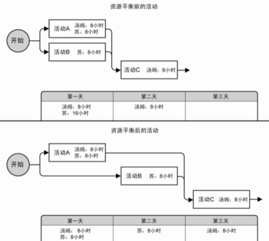  
+ 资源平衡。为了在资源需求与资源供给之间取得平衡，根据资源制约对开始日期和结束日期进行调整的一种技术。  
+ 资源平滑。对进度模型中的活动进行调整，从而使项目资源需求不超过预定的资源限制的一种技术。相对于资源平衡而言，资源平滑不会改变项目关键路径，完工日期也不会延迟。也就是说，活动只在其自由和总浮动时间内延迟。因此，资源平滑技术可能无法实现所有资源的优化。
## 关键链法
允许项目团队在任何项目进度路径上设置缓冲，以应对资源限制和项目不确定性。这种方法建立在关键路径法之上，考虑了资源分配、资源优化、资源平衡和活动历时不确定性对关键路径（通过关键路径法来确定）的影响。关键链法引入了缓冲和缓冲管理的概念。  
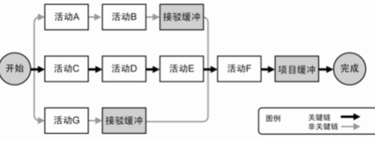  
## 进度压缩
进度压缩技术是指在不缩减项目范围的前提下，缩短进度工期，以满足进度制约因素、强制日期或其他进度目标。进度压缩技术包括（但不限于）：  
+ 赶工。通过增加资源，以最小的成本增加来压缩进度工期的一种技术。赶工的例子包括：批准加班、增加额外资源或支付加急费用，来加快关键路径上的活动。
+ 快速跟进。将正常情况下按顺序进行的活动或阶段改为至少是部分并行开展。例如，在大楼的建筑图纸尚未全部完成前就开始建地基。快速跟进可能造成返工和风险增加。
## 制订进度计划的输出
+ 进度基准
+ 项目进度计划
+ 进度数据
+ 项目日历
+ 项目管理计划更新
### 甘特图
甘特图也叫横道图，它以横线来表示每项活动的起止时间
+ 优点：简单、明了、直观、易于编制的，因此到目前为止仍然是小型项目中常用的工具。
+ 缺点：不能系统地表达一个项目所包含的各项工作之间的复关系，难以进行定量的计算和分析，以及计划的优化，同时也没有指出影响项目寿命周期的关键所在  
在大型工程项目中，它是高级管理层了解全局、基层安排进度时有用的工具。 
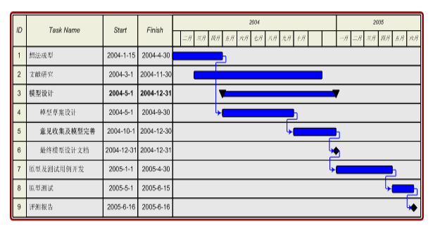  
## 项目日历
在项目日历中规定可以开展进度活动的工作日和工作班次。它把可用于开展进度活动的时间段（按天或更小的时间单位）与不可用的时间段区分开来。在一个进度模型中，可能需要采用不止一个项目日历来编制项目进度计划，因为有些活动需要不同的工作时段。可能需要对项目日历进行更新。  
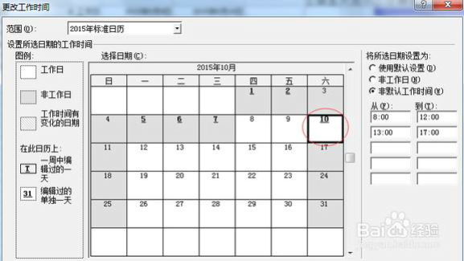  

# 控制进度
## 项目进度控制概念及内容
项目进度控制是依据项目进度基准计划对项目的实际进度进行监控，使项目能够按时完成。
有效项目进度控制的关键是监控项目的实际进度，及时、定期地将它与计划进度进行比较，并立即采取必要的纠正措施。
## 项目进度控制比较分析
+ 横道图比较法。
+ S型曲线比较法。
+ “香蕉”曲线比较法。
### 横道图比较法
    
### S型曲线比较法
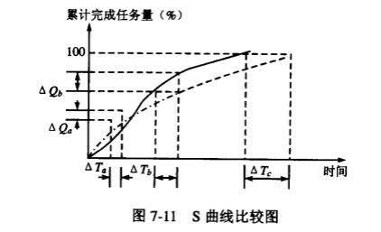
### “香蕉” 曲线比较法
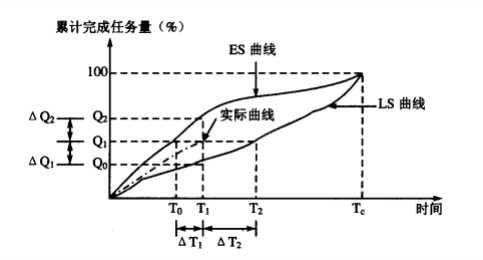  
## 时标网络图
以水平时间坐标为尺度表示工作时间，以实箭线表示工作，实箭线的水平投影长度表示该工作的持续时间；  
以虚箭线表示虚工作,由于虚工作的持续时间为零，故虚箭线只能垂直画；  
以波形线表示工作与其紧后工作之间的时间间隔。
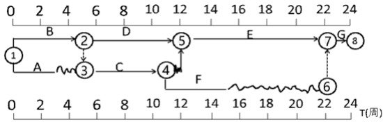  
+ 关键路径：凡自始至终不出现波形线的线路为关键路径。
+ 自由时差就是该工作箭线上波形线的长度
+ 总时差：以该工作为起点工作，寻找通过该工作的所有线路，然后计算各条线路的波形线的长度和，波形线长度和的最小值就是该工作的总时差（如果它在关键路径上，总时差就是0）。
## 缩短活动工期方法
+ 关键活动的调整（快速跟进）
+ 非关键活动的调整
+ 投入更多的资源以加速活动进程（赶工）
+ 指派经验更丰富的人去完成或帮助完成项目工作。
+ 减小活动范围或降低活动要求。
+ 改进方法或技术提高生产效率。