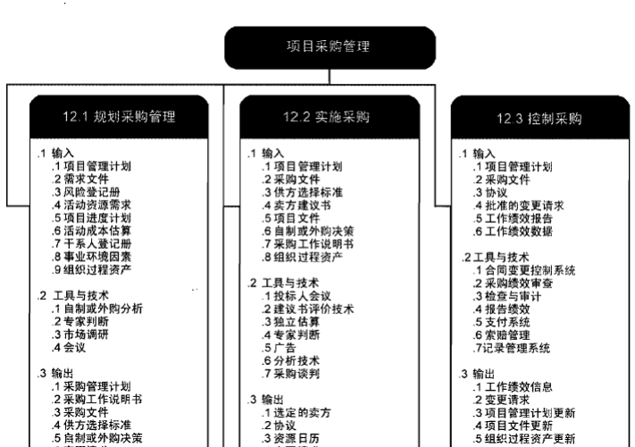
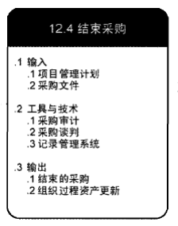

  
# 采购管理的相关概念和主要过程
## 概念和术语
项目采购是从项目外部购买项目所需的产品和服务的过程
+ 采购过程涉及双方或多方，各方在一定市场条件下相互影响和制约。
+ 通过流程化和标准化的采购管理和运作，可以达到降低成本、增加利润的作用。
+ IT项目采购对象分为工程、产品/货物和服务三类。
## 项目采购管理过程
+ 编制采购计划。决定采购什么，何时采购，记录项目采购决策、明确采购方法、识别潜在卖方的过程。
+ 实施采购。获取卖方应答、选择卖方并授予合同的过程。
+ 控制采购。管理采购关系、监督合同执行情况，并根据需要实施变更和采取纠正措施的过程。
+ 结束采购。完结单次项目采购的过程。

# 编制采购计划
采购计划是确定项目的哪些需求可通过采购项目组织之外的产品和服务来满足，以及评估潜在卖方的过程  
采购计划的目标包括决定是否采购、怎样采购、采购什么、什么时候釆购，去哪采购等内容。  
## 采购策略
项目管理者在编制采购计划时，首先要考虑项目是否需要采购，哪些项目需求只能通过采购来满足，哪些任务需要项目执行组织自己完成。  
其次还应考虑采购方式，是招标方式还是询价方式。对于全部或部分使用国有资金的项目，《中华人民共和国招标投标法》已明确规定必须采用招标方式。对于使用企业自有资金的项目，企业可根据拟采购产品和服务的具体性质决定采用何种方式。
## 合同类型选择
不同类型的采购应采用适合其特点的合同。合同分成三大类：  
+ 固定价格合同
+ 成本补偿合同
+ 工料合同
## 编制采购计划的输出
+ 采购管理计划  采购管理计划是项目管理计划的组成部分，说明项目团队将如何从执行组织外部获取货物和服务，以及如何管理从编制采购文件到合同收尾的各个采购过程。
+ 采购工作说明书  采购SOW应该详细描述拟采购的产品、服务或成果，以便潜在卖方确定他们是否有能力提供这些产品、服务或成果。至于应该详细到何种程度，会因采购品的性质、买方的需要或拟用的合同形式而异，内部的工作说明书也称为任务书。工作说明书中包括前言、服务范围、方法、假定、服务期限和工作量估计、双方角色和责任、交付资料、完成标准、顾问组人员、收费和付款方式、变更管理等。
+ 采购文件  采购文件是用于征求潜在卖方的建议书。如果主要依据价格来选择卖方（如购买商业或标准产品时），通常就使用标书、投标或报价等术语。如果主要依据其他考虑（如技术能力或技术方法）来选择卖方，通常就使用诸如建议书的术语。不同类型的采购文件有不同的常用名称，可能包括信息邀请书（RFI）、投标邀标书（IFB）、建议邀请书（RFP）、报价邀请书（RFQ）、投标通知、谈判邀请书及卖方初始应答邀请书。具体的采购术语可能因行业或采购地点而异。
+ 供方选择标准
+ 自制或外购决策
+ 变更请求
+ 项目文件更新 

# 实施采购
## 实施采购过程的工作
+ 从潜在的卖方处获取如何满足项目需求的答复，如投标书和建议书。通常在这个过程中由潜在的卖家完成大部分实际工作，买方无需支付直接费用。
+ 接受多个潜在的卖方的标书或建议书后，根据供方选择标准选择一个或多个合适的卖方，并与选中的卖方签订合同。
## 采购
采购可分为招标采购和非招标采购两种方式。  
+ 招标采购是由买方提出招标条件，由许多供应商同时投标竞争。通过招标方式，购买方一般可以获得非常合理的价格和优惠的产品供应条件，同时也可以促使供应商之间公平竞争。
+ 非招标方式多用于标准规格的产品采购，通过市场多方询价的方式，选择供应商，这是一种简便易行的采购方式。  

政府采购的方式包括：
+ 公开招标 
+ 邀请招标 符合下列情形之一的货物或服务，可采用邀请招标方式采购：
    + 具有特殊性，只能从有限范围的供应商处采购
    + 采用公开招标方式的费用占政府采购项目总价值的比例过大。
+ 竞争性谈判 是指采购人或者采购代理机构直接邀请三家以上供应商就采购事宜进行谈判的方式。符合下列情形之一的货物或服务，可采用竞争性谈判方式采购：  
    + 招标后没有供应商投标或没有合格标的或重新招标未能成立；
    + 技术复杂或性质特殊，不能确定详细规格或具体要求；
    + 采用招标所需时间不能满足用户紧急需要；
    + 不能事先计算出价格总额。
+ 单一来源采购 符合下列情形之一的货物或服务，可以采用单一来源方式采购
    + 只能从唯一供应商处采购；
    + 发生了不可预见的紧急情况，不能从其他供应商处采购；
    + 必须保证原有采购项目一致性或服务配套的要求，需要继续从原供应商处添购，且添购资金总额不超过原合同采购金额的10%。
+ 询价 采购的货物规格、标准统一、现货货源充足且价格变化幅度小的政府采购项目，可以采用询价方式采购

## 供方选择
供方选择包括：使用评估标准评估，对供应商进行选择。  
价格通常是最重要的因素，但并不是决定因素。价格因素在供方选择中所占的权重，要根据项目采购的具体内容而定。  
+ 对于有明确质量要求、检验比较容易的简单通用设备的采购，价格因素可占70%〜80%的权重；
+ 对于技术含量较高、个性化较强、需要二次开发、质量要求难以量化、测试评估比较困难的复杂系统的采购，价格因素只能占40%〜60%的权重。

供应方的资质、信誉、技术实力、以往的案例，尤其是供方技术方案的可行性、先进性和成熟性，均应作为供方选择的重要依据。

# 控制采购
控制采购是管理采购关系、监督合同执行情况，并根据需要实施变更和采取纠正措施的过程。  
控制采购过程的主要目标：
+ 保证合同的有效执行
+ 保证采购产品及服务质量的控制  

# 结束采购
结束采购是完结单次项目采购的过程。本过程的主要作用是，把合同和相关文件归档以备将来参考。  
+ 结束采购过程还包括一些行政工作，例如，处理未决索赔、更新记录以反映最后的结果，以及把信息存档供未来使用等。
+ 采购结束后，未决争议可能需要进入诉讼程序。合同条款和条件可以规定结束采购的具体程序。