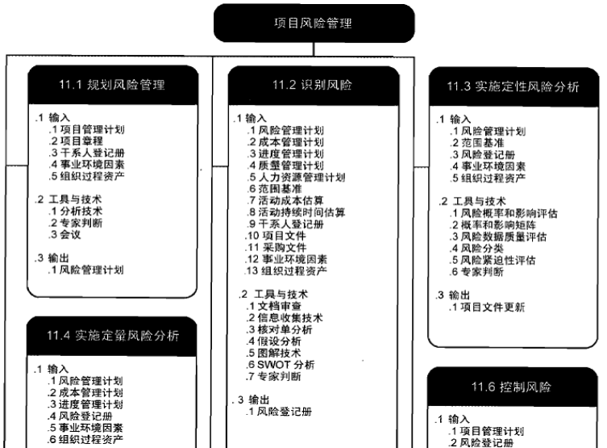
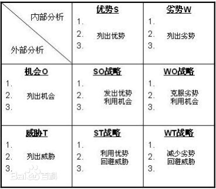
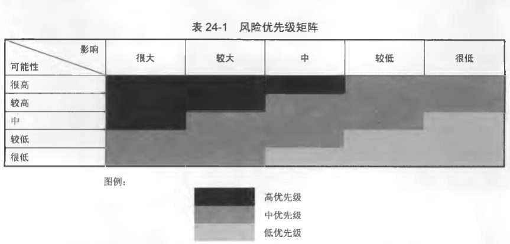
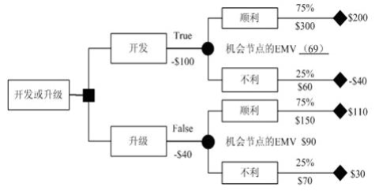

  
# 风险管理概述
## 风险的定义
风险表达了一种概率，具有偶发性。对于项目中的风险可以简单地理解为项目中的不确定因素。  
从广义的角度说，风险是一种不确定性，一旦发生，既可能对当前情况产生积极的影响，也可能产生消极的影响。也就是说，风险发生后既可能给项目带来问题，也可能会项目带来机会。  
## 风险的分类
### 按照性质划分
+ 纯粹风险
+ 投机风险
### 按照产生的原因划分
+ 自然风险
+ 社会风险
+ 政治风险
+ 经济风险
+ 技术风险

# 项目风险管理
## 风险管理
就是要在风险成为影响项目成功的威胁之前，识别、着手处理并消除风险的源头。  
项目管理班子通过风险识别、风险估计并以此为基础，合理地使用多种管理方法、技术和手段对项目活动涉及的风险实行有效的控制，采取主动行动，创造条件，尽量扩大风险事件的有利结果，妥善地处理风险事故造成的不利后果，以最少的成本，保证安全、可靠地实现项目的总目标。  
对于项目而言，风险不仅意味着问题的隐患，风险与机会并存，高风险的项目往往有着高的收益。相反，没有任何风险的项目（如果存在的话)，不会有任何利润可图。  
作为项目经理要管理好项目中的风险，避免风险造成的损失，提高项目的收益率。  
## 风险管理包含6个主要活动：
+ 规划风险管理。 确定项目中风险管理活动的步骤。
+ 识别风险。确定项目中可能存在的风险。
+ 实施定性的风险分析。 通过对风险的发生概率和潜在影响排定风险优先级，为后续的分析做准备。
+ 实施定量的风险分析。 量化分析风险对项目目标的影响。
+ 规划风险应对。制订相应的策略，减轻风险对项目目标的影响。
+ 风险跟踪与监控。跟踪并监控识别出的风险，执行风险应对策略，并评估其在整个项目生命周期中的效果。

# 规划风险管理
制订风险管理计划是风险管理的开始环节，也是风险管理的关键环节。后续的风险识别、风险分析、风险跟踪都需要建立在风险管理计划的基础上。  
在风险管理计划中需要定义：风险管理活动、风险级别、类型等内容。一般在项目计划早期就要考虑项目中的风险管理计划。  
一份完整的风险管理计划要包含如下内容  
+ 方法。在这里定义出风险管理的步骤和工具，如风险识别方法、风险评估方法、使用风险跟踪矩阵跟踪识别出的风险等。
+ 角色。风险管理中肯定有人的参与。在这里定义出人在风险管理中充当的角色和责任。
+ 预算。风险管理需要投入一定的人力和物力，在风险计划中当然要对投入的人力和物力进行估计。
+ 频度。风险管理需要贯穿项目生命周期的始终，在这里定义风险管理活动进行的频度，如每周召开一次风险评估会议，或里程碑开始前评估里程碑中的风险。这些预计的风险管理活动也需要反映在项目进度表中。
+ 风险类别。把项目中的风险划分为：技术风险、团队风险、外部风险等。不同的风险类别会有不同的风险应对措施，对于技术风险可以通过聘请技术专家的方法降低风险发生的概率；而对于团队风险则需要增强团队培训和团队建设。为了更细致地表现风险的类别，可以采用风险分解结构 RBS
+ 风险发生概率和影响。这是风险重要的两个属性之一，通过风险概率和风险影响可以描绘出风险的重要程度。
+ 风险跟踪过程。在风险管理计划中，需要文档化风险跟踪过程的定义，作为后续风险跟踪活动的准则。
+ 风险报告模板。由于关注项目风险的人不仅是项目经理，还包括项目组成员、组织乃至客户，因此一份定义的风险报告是必要的。
## 风险计划的其他内容
项目除了编制风险管理计划之外，还有应急计划和应急储备。
+ 应急计划。是指当一项可能的风险事件实际发生时项目团队将采取的预先确定的措施。
+ 应急储备。是指根据项目发起人的规定，如果项目范围或者质量发生变更，这一部分资金可以减少成本或进度风险。  

# 识别风险
风险识别是判断哪些风险可能影响项目并记录其特征的过程。  
+ 风险识别是风险分析和跟踪的基础，项目经理需要通过风险识别过程确认项目中潜在的风险，并制订风险防范策略。
+ 风险识别的结果是一份风险列表，其中记录了项目中所有发现的风险。在通过对风险进行分析后，制订相应的风险防范和应对措施，并安排专人对风险进行跟踪。
## 风险识别的方法
+ 专家评估法（德尔菲法）
+ 头脑风暴法
+ SWOT分析法
+ 风险检查表
+ 因果图法（鱼骨图）
+ 假设分析
### SWOT分析法
SWOT分析法是用来确定企业自身的竞争优势、竞争劣势、机会和威胁，从而将公司的战略与公司内部资源、外部环境有机地结合起来的一种科学的分析方法。  
SWOT，是Strength(优势)、Weakness(劣势)、Opportunity(机遇)和Threat(挑战)的简写。  
S 、W 是内部因素，O 、T  是外部因素。
  
## 风险库
项目风险库中包含了许多项目的风险管理文档，包括风险列表、风险跟踪矩阵等，通过这些文档可以描述一个项目完整的风险情况。  
在同一个组织内，项目过程、团队情况、行业背景都非常类似，不确定因素大都相同的，风险库可以更有效地帮助识别风险。
## IT项目中常见的风险
+ 需求风险
+ 技术风险
+ 团队风险
+ 关键人员风险
+ 预算风险
+ 范围风险

# 实施定性风险分析
## 风险分析
在得到了项目风险列表后，需要对其中的风险做进一步的分析，以明确各风险的属性和要素，这样才可以更好地制订风险应对措施。  
风险分析可以分为定性分析和定量分析两种方式。风险定性分析是一种快捷有效的风险分析方法，一般经过定性分析的风险已经有足够的信息制订风险应对措施并进行跟踪与监控。在定性风险分析的基础上，可以进行风险定量分析。定量分析的目的并不是获得数字化的结果，而是得到更精确的风险情况，以便进行决策。  
## 进行风险定性分析包括以下几个方面
### 风险可能性与影响分析
由于在进行风险定性分析时，没有量化的标准，因此不可能分析风险发生的概率，但可以对风险发生的可能性进行大致的评估。除了风险发生的可能性，还应当分析风险对项目的影响。风险影响分析应当全面，需要包括对时间、成本、范围等各方面的影响。  
### 排定风险优先级
在确定了风险的可能性和影响后需要进一步确定风险优先级。风险优先级是一个综合的指标，优先级的高低反映了风险对项目的综合影响，也就是说，高优先级的风险最可能对项目造成严重的影响。
  
### 确定风险类型
在进行风险定性分析时需要确定风险的类型.  
根据风险管理计划中定义的风险类型列表或者RBS可以为分析中的风险找到合适的类型。

# 实施定量风险分析
相对于定性分析来说，风险定量分析更难操作。一般先进行风险的定性分析，在有了对风险相对清晰的认识后，再进行定量分析，制订相应的策略。  
## 定量分析方法
采取专家评估的方法是一种比较简单的量化分析方法
如，组织相关成员对项目进行乐观、中性和悲观估计。还可以使用项目风险模型采用模拟的方法来进行量化分析。  
如，蒙特卡罗分析，把项目的风险转化为对时间、费用和目标的影响，并作为风险模型的输入。如，决策树分析。
## 决策树分析法
是一种运用概率与图论中的树对决策中的不同方案进行比较，从而获得最优方案的风险型决策方法。  
  

# 规划风险应对
## 风险应对策略
制订风险应对计划时有多种不同的策略，对于相同的风险，采用不同的应对策略会有不同的应对方法。  
项目风险的应对包括对风险有利机会的跟踪和对风险不利影响的控制。因此，风险应对规划策略可分为以下三种：  
+ 消极风险或威胁的应对策略
+ 接受
+ 积极风险或机会的应对策略
### 消极风险或威胁的应对策略
对项目目标存在消极影响的风险或威胁可以采取回避、转移与减轻等策略，其目的是降低风险发生的概率或减轻风险带来的损失。  
+ 避免策略是想方设法阻止风险的发生或消除风险发生的危害。
+ 转移策略是将风险转嫁给其他的组织或个体，通过这种方式来降低风险发生后的损失。
+ 减轻策略。当风险很难避免或转移时，可以考虑采取减轻策略来降低风险发生的概率或减轻风险带来的损失。
### 接受
采取该策略的原因在于很少可以消除项目的所有风险。采取此项措施表明，已经决定不打算为处置某项风险而改变项目计划，无法找到任何其他应对良策的情况下，或者为应对风险而采取的对策所需要付出的代价太高（尤其是当该风险发生的概率很小时），往往采用“接受”这一措施。  
+ 被动接受
+ 主动接受
### 积极风险或机会的应对策略
使用三种策略应对可能对项目目标存在积极影响的风险。这些策略分别是开拓、分享和提高。  
+ 开拓。该项策略的目的在于通过确保机会肯定实现而消除与特定积极风险相关的不确定性。
+ 分享。指将风险的责任分配给最能为项目的利益获取机会的第三方，包括建立风险分享合作关系，或专门为机会管理目的的形成团队
+ 提高。通过提高积极风险的概率或其积极影响，识别并最大程度发挥这些积极风险的驱动因素，致力于改变机会的“大小”。

# 控制风险
## 控制风险
有效的风险管理需要在整个项目生命周期过程中都对风险进行跟踪与监控。  
经过制订风险计划、识别风险、风险分析和制订风险应对计划后，项目中的风险已经比较清晰，这时就要进入风险跟踪与监控过程。  
风险跟踪与监控不仅是对已经识别出的风险的状态进行跟踪，还包括：监控风险发生标志、更深入地分析己经识别出的风险、继续识别项目中新出现的风险、复审风险应对策略的执行情况和效果。
## 风险监控的目的和主要工作内容
### 风险监控的目的
风险监控的基本目的是以某种方式驾驭风险，保证项目可靠、高效地完成项目目标。要求我们制定科学的风险监控标准，采用系统的管理方法，建立有效的风险预警系统，做好应急计划，实施高效的项目风险监控。  
### 执行风险管理计划和风险管理流程
项目风险管理并不会停留在最初的风险分析上，识别的风险也许并不真的发生。先前识别的风险，也可能被确定有更大的发生概率，或更高的损失估计值。  
### 采取应急措施
当风险有征兆时，采取制定好的应急活动。
### 采取权变措施
对风险事件未计划的风险事件使用权变措施。
在监控风险的过程中，遇到以往未曾识别或被动接受的、目前正在发生的风险而采取的未经事先计划的应对措施，就是权变措施。
## 在风险跟踪过程中的工作
### 重新评估风险。
项目的情况在不断地变化，在项目最初识别并分析的风险也会有相应的变化。除去已经发生或避免的风险外，残留的风险在发生可能性、影响等各个方面都会与以前不同。这时需要重新评估这些残留的风险，并更新风险列表。
### 过程审计。
在风险跟踪过程中，需要评估风险管理的效果。其中，包括风险应对措施的执行情况和效果风险管理过程的效果等。
### 分析。
在风险跟踪和监控中，需要分析的内容很多，包括：
+ 项目偏差情况。
+ 项目进展情况。
+ 储备情况。
### 风险跟踪与监控会议。
在项目进行过程中，根据风险管理计划将定期召开风险跟踪与监控会议。在会议中将对项目中的风险、应对策略的执行和风险跟踪的情况进行评估和总结。